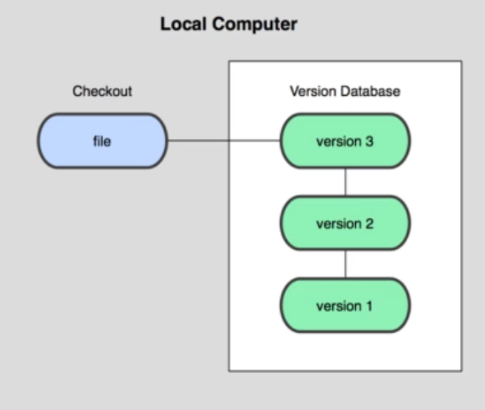
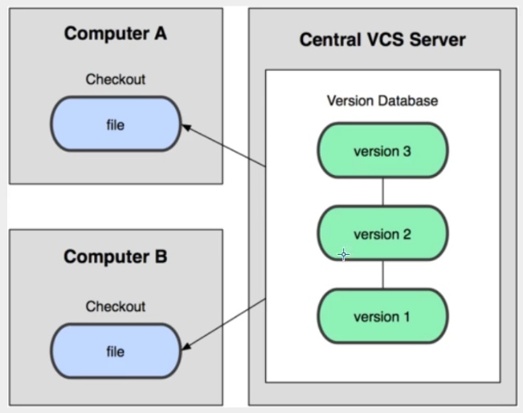
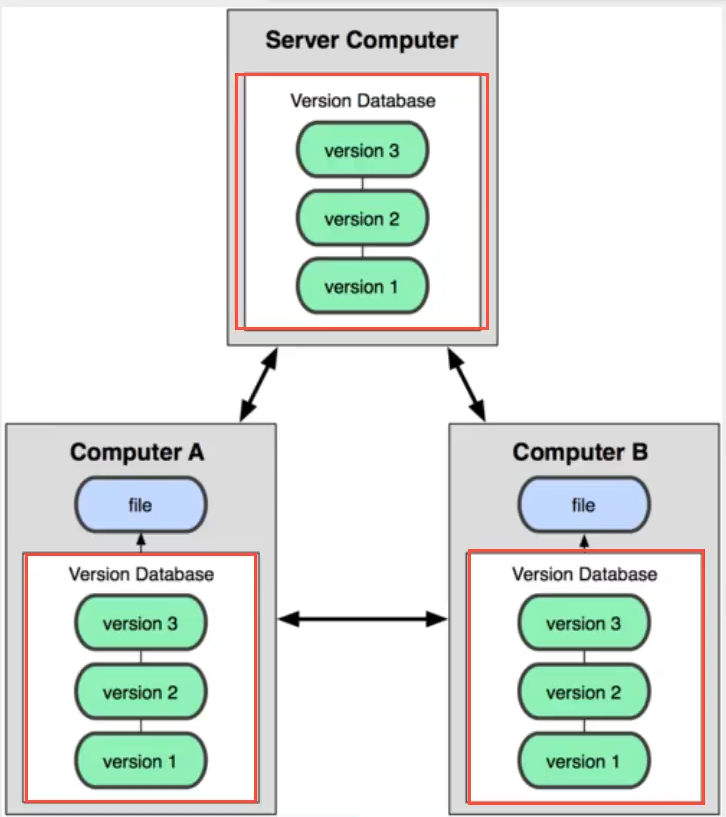
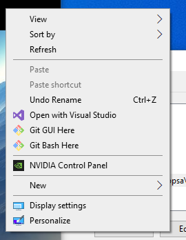
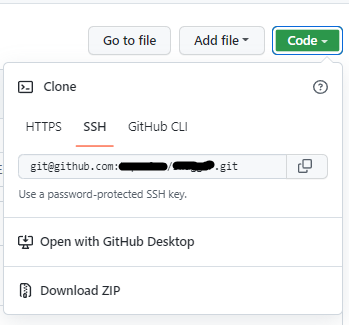
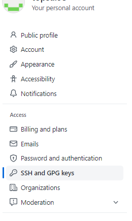
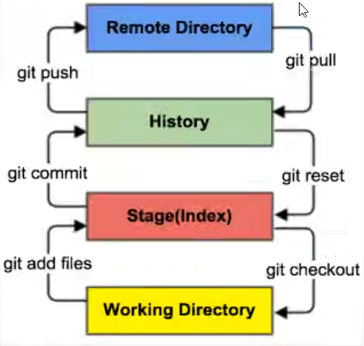
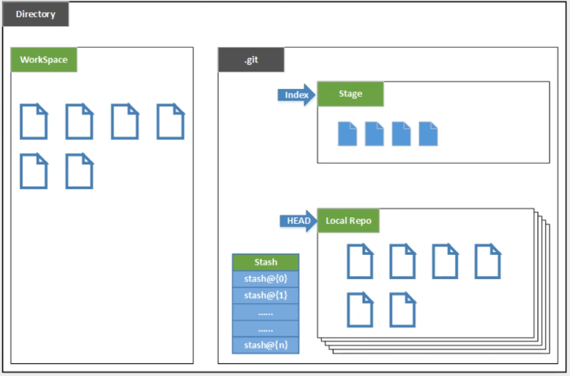
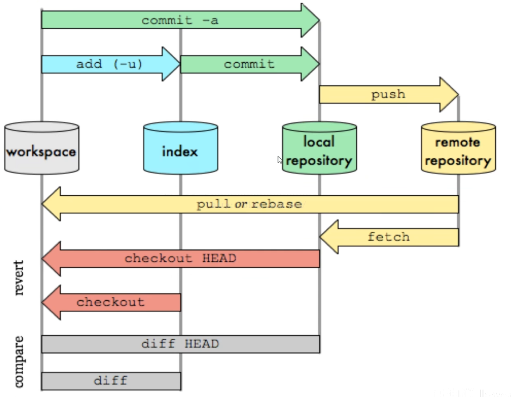

# Git
This is a learning notes.

learned from [狂神说](https://www.bilibili.com/video/BV1FE411P7B3?p=1&vd_source=a788bdd4d7cdd9dfe02852346d523cb9)

learned from [廖雪峰](https://www.liaoxuefeng.com/)

Total video length : 8h 11m 41s

25.06.2022 - start

26.06.2022 - complete

Environment: git version 2.35.1.windows.2

-----------------------

> **version control system**
>
> records the progress ==> able to check and compare history
>
> able to backup for recover
>
> able to use old version
>
> team member able to work and contribute at the same time ==> high efficiency


**Major version control system **

- **Git** (***)
- SVN (Subversion)
- CNS (Concurrent Versions System)
- VSS (Microsoft Visual SourceSafe)
- TFS (Team Foundation Server)
- Visual Studio Online
- ...


## Version Control

1. **Local Version Control System**
   - Records every update, snapshot every different version 
   - suitable for single developer



2. **Centralized Version Control System**
   - save in the server, developers update and upload his version.
   - have to connect server to get previous version. User have only his new version
   - conflict? decide a final internally.
   - risk if using one server, shall arrange auto backup
   - **SVN**, CVS, VSS

		

3. **Distributed Version Control System**

   - all versions synchronize to every single user computer. 
   - risk if some user take the data without permission
   - able to commit local, and push to server or others' computer once connect successfully.
   - old version is able to be recovered from others' computer if one's computer is dead.
   - Use space.
   - Git

   


## Start Git

1. **Installation**

>  https://git-scm.com/downloads



_tips: noticed GitBash when right clickon desktop._ 

2. **Set username and email (refer command section)**

3. **Initiate** **? Clone from remote directory?**

   **A)** **Initiate**

   - Right click (in the folder you would like to work on) - git Bash Here - `git init`

   - .git file is created (hidden file)

   **B) Clone from remote directory**

   - `git clone [url]`
   - 
   - the directory will be in your folder

4. **generate SSH key from git hub and bind with your computer, achieve login without password**

   

   i) right click in your file (eg. \[C]:\Users\yourUser\\) -> bash

   ii) `ssh-keygen -t rsa -C [email]`  

   iii) noticed 2 files : 

   

   iv) open -d_rsa.pub and copy detail

   v)  in github ssh setting: click new SSH key and paste.

   

## Command

> ..Git\etc\gitconfig => system configs location
>
> \[C]:\Users\yourUser\\.gitconfig ==> global config


### Config and Initialization

`git config` 

```shell
-l 							#list
--system -l					#list system configs
--global -l					#list global configs (config by you)
--global user.name yourUname #set your username --> to login
--global user.email yourEmail #set your email  --> to login
```

`git init`


### Detail

`git status`

`git diff` //git diff [<options>] [<commit>] [--] [<path>…] eg git diff HEAD -- read1.txt

`git log` --pretty=oneline // see the version details --pretty=oneline = show only one line

`git log --graph --pretty=oneline --abbrev-commit`

`git reflog` //look back the previous command (incase you want to look back commit id)

`git rebase` 

```shell
user@DESKTOP MINGW64 ~/Desktop/testGit/testGit25062022 (master)
$ git log
commit 8fd4d20e93cadf74c73de6f6aa3065f9dbb205af (HEAD -> master)
Author: Jack <userl95@gmail.com>
Date:   Sat Jun 25 22:39:18 2022 +0800

    append GPL

commit 129f848e23b1254e0d5487af3e5c6eed6b43a1ff
Author: Jack <userl95@gmail.com>
Date:   Sat Jun 25 22:36:46 2022 +0800

    added distributed

commit 6971537c5984e055bcd88e274ea98511f06b330f
Author: Jack <userl95@gmail.com>
Date:   Sat Jun 25 22:32:25 2022 +0800

    wrote a read1 file
```

```shell
user@DESKTOP MINGW64 ~/Desktop/testGit/testGit25062022 (master)
$ git log --pretty=oneline
8fd4d20e93cadf74c73de6f6aa3065f9dbb205af (HEAD -> master) append GPL
129f848e23b1254e0d5487af3e5c6eed6b43a1ff added distributed
6971537c5984e055bcd88e274ea98511f06b330f wrote a read1 file


```


### Works with Working Sections

`git add [file(s) / .]` //when update and add file

`git rm <file>` //when deleted file

`git commit  -m "x commit"`  - // message to bring 

`git restore <file>` //undo an yet added file. older version : git checkout **--** <file> ** must use -- as this command overload with other function.

`git restore --staged <file>` //undo an added file. older version: git reset HEAD <file>

`git reset` --hard [commit id(first few digits enough for Git to find) / HEAD^ / HEAD~[num]] //switch to specified commit

> soft: change HEAD. this file change to state : before "commit" and after "add" 
>
> mixed: change HEAD. this file change to state : back to before "add"
>
> hard: change HEAD. this file destroyed

**Tips:** use below reference for your commit message, for faster review in future
```
- feat：添加新功能
- fix：修补缺陷
- docs：修改文档
- style： 修改格式
- refactor：重构
- perf：优化
- test：增加测试
- chore：构建过程或辅助工具的变动
- revert：回滚到上一个版本

eg git commit -m "fix: ..., fix #1, #2"
```

**Tips:** we can put icon in our commit too: https://zhuanlan.zhihu.com/p/30561653

### Remote

`git clone [url]`

`git remote add origin [url]` //link your directory to origin

`git remote -v` // check origin details

`git remote rm <name>` // eg git remote rm origin ==> unbind with remote , NOT delete github repository

`git push <remote> <branch>`//push to remote

`git push -u <remote> <branch>` // push by identify origin branch AND set upstream to it, then next push `git push` will be okay d. `git branch -vv` to watch the upstream (in blue colour)

`git push --set-upstream <remote> <branch> ` //set upstream to origin master

`git push <remote> <tag>`

`git push <remote> --tags` //push all tags

`git push origin :refs/tags/<tag>` //delete tag from remote

`git pull <remote> <branch>` 

**Tips:** we can use `git push origin` only to push to the origin by default current branch, we may use `git push` if there is only one branch. use `git branch -r` to list remote branch names  

```shell
user@DESKTOP MINGW64 ~/Desktop/testGit/testGit25062022 (master)
$ git push origin --tags
Total 0 (delta 0), reused 0 (delta 0), pack-reused 0
To https://github.com/userl95/testGit25062022.git
 * [new tag]         v0.0 -> v0.0
 * [new tag]         v1.0 -> v1.0

user@DESKTOP MINGW64 ~/Desktop/testGit/testGit25062022 (master)
$ git push origin :refs/tags/v0.0
To https://github.com/userl95/testGit25062022.git
 - [deleted]         v0.0
```


### Branch

`git branch` //list branches

`git branch <NewBranchName>`//create new branch

`git branch -d <branchName>` //delete branch

`git switch <branchName>` //switch branch

`git switch -c <branchName>` //create new branch + switch branch 

`git switch -c <branchName> <origin/branch eg. origin/dev>` //create new branch + switch branch 

`git merge <branchName>` //merge <branchName> to current HEAD

`git merge  --no-ff -m "merge with no-ff" <branchName>` //merge without using fast-forward method which ff method leads to some lost information of <branchName> log 

`git cherry-pick <commit>` //pick the commit to the current branch, so there is no need to redo same commit again in different branch.


FF


-------------------

no-FF


### Stash

`git stash list` //to list the stash

`git stash -m <message>`  / `git stash push <message>` // to create a stash

`git stash pop [index]` //to pop out from stash (default : 0)

`git stash apply [index]` //to get from stash without deleting (default : 0)

`git stash drop [index]` //to delete the  (default : 0)

`git stash clear` //clear the stashes


### Tag

`git tag <tag>`

`git tag <tag> <commitId>`

`git tag -a <tag> -m <message> <commitId>`

`git tag -d <tag>` //delete

`git show <tag`

```shell
user@DESKTOP MINGW64 ~/Desktop/testGit/testGit25062022 (master)
$ git tag  v1.0

user@DESKTOP MINGW64 ~/Desktop/testGit/testGit25062022 (master)
$ git tag v0.0 6971

user@DESKTOP MINGW64 ~/Desktop/testGit/testGit25062022 (master)
$ git log --pretty=oneline --abbrev-commit
66751a7 (HEAD -> master, tag: v1.0, origin/master) merge 'dev'
1eeb515 tested stash
ed27fea bug Fixed
99121e8 bug Fixed
fe7152a conflict fixed
0345a89 & simple
5bbfed0 and simple.
76d6e00 removed deleteme
9f27e9f branch test
44c94cb deleteme
3a73c11 deleted test.txt
1e4ab74 add test.txt
8fd4d20 append GPL
129f848 added distributed
6971537 (tag: v0.0) wrote a read1 file

user@DESKTOP MINGW64 ~/Desktop/testGit/testGit25062022 (master)
$ git show v1.0
commit 66751a7f6d5cc5bead946fa10778286fa58c1b37 (HEAD -> master, tag: v1.0, origin/master)
Merge: 99121e8 1eeb515
Author: Jack <userl95@gmail.com>
Date:   Sun Jun 26 12:38:36 2022 +0800

    merge 'dev'

```


## Git Theory

3 working section (Local):

- Working directory
- Stage/Index
- Repository/ Git Directory

1 more (Remote) :

- Remote Directory (so called Origin)



> Working directory

- where we save the file


> Stage/ Index 

- a file temporarily save the information of the file which to be committed

  

> Repository (.git/HEAD => ref: )

- save your versions


> Remote Directory

- Github






## 4 Status

> A very good explanation : https://www.liaoxuefeng.com/wiki/896043488029600/897271968352576 (in chinese)

1. Untracked : untracked and yet put in stage, not involved in version control, use `git add` to become staged 

2. Unmodified : file have been put in stage . ===> no modified (snapshot data same with your file).  Two actions for this state

   A) once modified -> became modified

   B) `git rm` to become untracked

3. Modified : file is modified. Two actions for this state

   A) `git add` to become staged

   B) `git checkout` to become unmodified (which take the file from stage to overwrite current file)

4. Staged : `git commit` to update into git directory , in this time the local file and git directory file are same, file will become unmodified status. `git reset HEAD filename` to cancel, which move back to modified

   ```shell
   testGit@DESKTOP MINGW64 ~/Desktop/testGit (master)
   $ git status
   On branch master
   
   No commits yet
   
   nothing to commit (create/copy files and use "git add" to track)
   
   testGit@DESKTOP MINGW64 ~/Desktop/testGit (master)
   $ touch hello.txt
   
   testGit@DESKTOP MINGW64 ~/Desktop/testGit (master)
   $ git status
   On branch master
   
   No commits yet
   
   Untracked files:
     (use "git add <file>..." to include in what will be committed)
           hello.txt
   
   nothing added to commit but untracked files present (use "git add" to track)
   
   testGit@DESKTOP MINGW64 ~/Desktop/testGit (master)
   $ git add .
   
   testGit@DESKTOP MINGW64 ~/Desktop/testGit (master)
   $ git status
   On branch master
   
   No commits yet
   
   Changes to be committed:
     (use "git rm --cached <file>..." to unstage)
           new file:   hello.txt
   
   
   testGit@DESKTOP MINGW64 ~/Desktop/testGit (master)
   $ git commit -m "new hello file"
   [master (root-commit) fd592f4] new hello file
    1 file changed, 0 insertions(+), 0 deletions(-)
    create mode 100644 hello.txt
   
   testGit@DESKTOP MINGW64 ~/Desktop/testGit (master)
   $ git status
   On branch master
   nothing to commit, working tree clean
   
   
   ```

   

## myExercise

*** in git, there are big number represent commit id generated using SHA1 algorithm eg: below yellow fonts


### **Basic**

- git init
- git add
- git commit
- git diff

```shell
user@DESKTOP MINGW64 ~/Desktop/testGit/testGit25062022 (master)
$ git init
Initialized empty Git repository in C:/Users/user/Desktop/testGit/testGit25062022/.git/

user@DESKTOP MINGW64 ~/Desktop/testGit/testGit25062022 (master)
$ vim read1.txt

```

> Git is a version control system.
> Git is free software.

```shell
user@DESKTOP MINGW64 ~/Desktop/testGit/testGit25062022 (master)
$ git add read1.txt

user@DESKTOP MINGW64 ~/Desktop/testGit/testGit25062022 (master)
$ git commit -m "wrote a read1 file"
[master (root-commit) 6971537] wrote a read1 file
 1 file changed, 2 insertions(+)
 create mode 100644 read1.txt
 
user@DESKTOP MINGW64 ~/Desktop/testGit/testGit25062022 (master)
$ vim read1.txt
```

> Git is a distributed version control system.
> Git is free software.

```shell
user@DESKTOP MINGW64 ~/Desktop/testGit/testGit25062022 (master)
$ git diff	#difference
diff --git a/read1.txt b/read1.txt
index 46d49bf..9247db6 100644
--- a/read1.txt
+++ b/read1.txt
@@ -1,2 +1,2 @@
-Git is a version control system.
+Git is a distributed version control system.
 Git is free software.
 
user@DESKTOP MINGW64 ~/Desktop/testGit/testGit25062022 (master)
$ git commit -m "added distributed"
[master 129f848] added distributed
 1 file changed, 1 insertion(+), 1 deletion(-)

user@DESKTOP MINGW64 ~/Desktop/testGit/testGit25062022 (master)
$ vim read1.txt
```

> Git is a distributed version control system.
> Git is free software distributed under the GPL.

```shell
user@DESKTOP MINGW64 ~/Desktop/testGit/testGit25062022 (master)
$ git add read1.txt

user@DESKTOP MINGW64 ~/Desktop/testGit/testGit25062022 (master)
$ git commit -m "append GPL"
[master 8fd4d20] append GPL
 1 file changed, 1 insertion(+), 1 deletion(-)

```


###  Go to history commit

- git reset [commit id(first few digits enough for Git to find) / HEAD^ / HEAD~[num]]
- git reflog

```shell
user@DESKTOP MINGW64 ~/Desktop/testGit/testGit25062022 (master)
$ git reset --head HEAD^  #Go backward ONE version from current
Unstaged changes after reset:
M       read1.txt


user@DESKTOP MINGW64 ~/Desktop/testGit/testGit25062022 (master)
$ git log --pretty=oneline #Show log
129f848e23b1254e0d5487af3e5c6eed6b43a1ff (HEAD -> master) added distributed
6971537c5984e055bcd88e274ea98511f06b330f wrote a read1 file

user@DESKTOP MINGW64 ~/Desktop/testGit/testGit25062022 (master)
$ git reset 8fd4d20 	#Go to version by using commit id

user@DESKTOP MINGW64 ~/Desktop/testGit/testGit25062022 (master)
$ git log --pretty=oneline
8fd4d20e93cadf74c73de6f6aa3065f9dbb205af (HEAD -> master) append GPL
129f848e23b1254e0d5487af3e5c6eed6b43a1ff added distributed
6971537c5984e055bcd88e274ea98511f06b330f wrote a read1 file

user@DESKTOP MINGW64 ~/Desktop/testGit/testGit25062022 (master)
$ git reflog #show HEAD movements
8fd4d20 (HEAD -> master) HEAD@{0}: reset: moving to 8fd4d20
129f848 HEAD@{1}: reset: moving to HEAD^
8fd4d20 (HEAD -> master) HEAD@{2}: commit: append GPL
129f848 HEAD@{3}: commit: added distributed
6971537 HEAD@{4}: commit (initial): wrote a read1 file

```


### **Regret**

- git restore <file>
- git restore --staged <file>

```shell
#before add but regret#
user@DESKTOP MINGW64 ~/Desktop/testGit/testGit25062022 (master)
$ vim read1.txt

user@DESKTOP MINGW64 ~/Desktop/testGit/testGit25062022 (master)
$ cat readme.txt
Git is a distributed version control system.
Git is free software distributed under the GPL.
My stupid boss still prefers SVN. ###Added

@DESKTOP MINGW64 ~/Desktop/testGit/testGit25062022 (master)
$ git restore read1.txt

user@DESKTOP MINGW64 ~/Desktop/testGit/testGit25062022 (master)
$ cat read1.txt
Git is a distributed version control system.
Git is free software under the GPL.

#added but regret#

user@DESKTOP MINGW64 ~/Desktop/testGit/testGit25062022 (master)
$ vim read1.txt

user@DESKTOP MINGW64 ~/Desktop/testGit/testGit25062022 (master)
$ cat readme.txt
Git is a distributed version control system.
Git is free software distributed under the GPL.
My stupid boss still prefers SVN. ###Added

user@DESKTOP MINGW64 ~/Desktop/testGit/testGit25062022 (master)
$ git add read1.txt

user@DESKTOP MINGW64 ~/Desktop/testGit/testGit25062022 (master)
$ git status
On branch master
Changes to be committed:
  (use "git restore --staged <file>..." to unstage)
        modified:   read1.txt


user@DESKTOP MINGW64 ~/Desktop/testGit/testGit25062022 (master)
$ git restore --staged read1.txt

user@DESKTOP MINGW64 ~/Desktop/testGit/testGit25062022 (master)
$ git status
On branch master
Changes not staged for commit:
  (use "git add <file>..." to update what will be committed)
  (use "git restore <file>..." to discard changes in working directory)
        modified:   read1.txt

no changes added to commit (use "git add" and/or "git commit -a")
user@DESKTOP MINGW64 ~/Desktop/testGit/testGit25062022 (master)
$ git restore read1.txt

user@DESKTOP MINGW64 ~/Desktop/testGit/testGit25062022 (master)
$ cat read1.txt
Git is a distributed version control system.
Git is free software under the GPL.

#commited but regret#
user@DESKTOP MINGW64 ~/Desktop/testGit/testGit25062022 (master)
$ vim read1.txt

user@DESKTOP MINGW64 ~/Desktop/testGit/testGit25062022 (master)
$ cat readme.txt
Git is a distributed version control system.
Git is free software distributed under the GPL.
My stupid boss still prefers SVN. ###Added

user@DESKTOP MINGW64 ~/Desktop/testGit/testGit25062022 (master)
$ git add read1.txt

user@DESKTOP MINGW64 ~/Desktop/testGit/testGit25062022 (master)
$ git commit -m "stupid boss"
[master dbcbe5e] stupid boss
 1 file changed, 1 insertion(+)

user@DESKTOP MINGW64 ~/Desktop/testGit/testGit25062022 (master)
$ git reset --hard HEAD^
HEAD is now at 8fd4d20 append GPL

user@DESKTOP MINGW64 ~/Desktop/testGit/testGit25062022 (master)
$ cat read1.txt
Git is a distributed version control system.
Git is free software under the GPL.
```


### **Remove file**

- git rm <file>

```shell
user@DESKTOP MINGW64 ~/Desktop/testGit/testGit25062022 (master)
$ touch test.txt

user@DESKTOP MINGW64 ~/Desktop/testGit/testGit25062022 (master)
$ git add test.txt

user@DESKTOP MINGW64 ~/Desktop/testGit/testGit25062022 (master)
$ git commit -m "add test.txt"
[master 1e4ab74] add test.txt
 1 file changed, 0 insertions(+), 0 deletions(-)
 create mode 100644 test.txt

user@DESKTOP MINGW64 ~/Desktop/testGit/testGit25062022 (master)
$ rm test.txt

user@DESKTOP MINGW64 ~/Desktop/testGit/testGit25062022 (master)
$ git status
On branch master
Changes not staged for commit:
  (use "git add/rm <file>..." to update what will be committed)
  (use "git restore <file>..." to discard changes in working directory)
        deleted:    test.txt

no changes added to commit (use "git add" and/or "git commit -a")

user@DESKTOP MINGW64 ~/Desktop/testGit/testGit25062022 (master)
$ git rm test.txt
rm 'test.txt'

user@DESKTOP MINGW64 ~/Desktop/testGit/testGit25062022 (master)
$ git commit
[master 3a73c11] deleted test.txt
 1 file changed, 0 insertions(+), 0 deletions(-)
 delete mode 100644 test.txt

```


### Remote

- git remote add origin [url]
- git push -u origin master
- git push
- git remote -v // check origin details
- git remote rm <name> // eg git remote rm origin ==> unbind with remote , NOT delete github repository

```shell
user@DESKTOP MINGW64 ~/Desktop/testGit/testGit25062022 (master)
$ git remote add origin git@github.com:userl95/testGit25062022.git


user@DESKTOP MINGW64 ~/Desktop/testGit/testGit25062022 (master)
$ git push -u origin master
Enumerating objects: 13, done.
Counting objects: 100% (13/13), done.
Delta compression using up to 12 threads
Compressing objects: 100% (9/9), done.
Writing objects: 100% (13/13), 1.06 KiB | 1.06 MiB/s, done.
Total 13 (delta 2), reused 0 (delta 0), pack-reused 0
remote: Resolving deltas: 100% (2/2), done.
To github.com:userl95/testGit25062022.git
 * [new branch]      master -> master
branch 'master' set up to track 'origin/master'.

user@DESKTOP MINGW64 ~/Desktop/testGit/testGit25062022 (master)
$ git remote -v
origin  git@github.com:userl95/testGit25062022.git (fetch)
origin  git@github.com:userl95/testGit25062022.git (push)

user@DESKTOP MINGW64 ~/Desktop/testGit/testGit25062022 (master)
$ git remote rm origin

user@DESKTOP MINGW64 ~/Desktop/testGit/testGit25062022 (master)
$ git remote -v

user@DESKTOP MINGW64 ~/Desktop/testGit/testGit25062022 (master)
$ git push
fatal: No configured push destination.
```


### Branch

```shell
user@DESKTOP MINGW64 ~/Desktop/testGit/testGit25062022 (master)
$ git branch dev

user@DESKTOP MINGW64 ~/Desktop/testGit/testGit25062022 (master)
$ git switch dev
Switched to branch 'dev'

user@DESKTOP MINGW64 ~/Desktop/testGit/testGit25062022 (dev)
$ git branch
* dev
  master

user@DESKTOP MINGW64 ~/Desktop/testGit/testGit25062022 (dev)
$ vim read1.txt

user@DESKTOP MINGW64 ~/Desktop/testGit/testGit25062022 (master)
$ cat read1.txt
Git is a distributed version control system.
Git is free software under the GPL.
Creating a new branch is quick.

user@DESKTOP MINGW64 ~/Desktop/testGit/testGit25062022 (dev)
$ git add read1.txt

user@DESKTOP MINGW64 ~/Desktop/testGit/testGit25062022 (dev)
$ git commit -m "branch test"
[dev 9f27e9f] branch test
 1 file changed, 1 insertion(+)

user@DESKTOP MINGW64 ~/Desktop/testGit/testGit25062022 (dev)
$ git switch master
Switched to branch 'master'
Your branch is up to date with 'origin/master'.

user@DESKTOP MINGW64 ~/Desktop/testGit/testGit25062022 (master)
$ cat read1.txt
Git is a distributed version control system.
Git is free software under the GPL.

user@DESKTOP MINGW64 ~/Desktop/testGit/testGit25062022 (master)
$ git merge dev
Updating 44c94cb..9f27e9f
Fast-forward
 read1.txt | 1 +
 1 file changed, 1 insertion(+)

user@DESKTOP MINGW64 ~/Desktop/testGit/testGit25062022 (master)
$ git branch -d dev
Deleted branch dev (was 9f27e9f).

user@DESKTOP MINGW64 ~/Desktop/testGit/testGit25062022 (master)
$ git branch
* master

user@DESKTOP MINGW64 ~/Desktop/testGit/testGit25062022 (master)
$ cat read1.txt
Git is a distributed version control system.
Git is free software under the GPL.
Creating a new branch is quick.
```

> Conflict: must solve manually by editing that file with conflict

```shell
user@DESKTOP MINGW64 ~/Desktop/testGit/testGit25062022 (master)
$ git switch -c dev
Switched to a new branch 'dev'

user@DESKTOP MINGW64 ~/Desktop/testGit/testGit25062022 (dev)
$ vim read1.txt #added: Creating a new branch is quick AND simple.

user@DESKTOP MINGW64 ~/Desktop/testGit/testGit25062022 (dev)
$ git add read1.txt

user@DESKTOP MINGW64 ~/Desktop/testGit/testGit25062022 (dev)
$ git commit -m "and simple."
[dev 5bbfed0] and simple.
 1 file changed, 1 insertion(+), 1 deletion(-)

user@DESKTOP MINGW64 ~/Desktop/testGit/testGit25062022 (dev)
$ git switch master
Switched to branch 'master'
Your branch is ahead of 'origin/master' by 2 commits.
  (use "git push" to publish your local commits)

user@DESKTOP MINGW64 ~/Desktop/testGit/testGit25062022 (master)
$ vim read1.txt #added: Creating a new branch is quick & simple.

user@DESKTOP MINGW64 ~/Desktop/testGit/testGit25062022 (master)
$ git add read1.txt

user@DESKTOP MINGW64 ~/Desktop/testGit/testGit25062022 (master)
$ git commit -m "& simple"
[master 0345a89] & simple
 1 file changed, 1 insertion(+), 1 deletion(-)

user@DESKTOP MINGW64 ~/Desktop/testGit/testGit25062022 (master)
$ git merge dev
Auto-merging read1.txt
CONFLICT (content): Merge conflict in read1.txt
Automatic merge failed; fix conflicts and then commit the result.

user@DESKTOP MINGW64 ~/Desktop/testGit/testGit25062022 (master|MERGING)
$ vim read1.txt
```

>From:
>
>Git is a distributed version control system.
>Git is free software under the GPL.
><<<<<<< HEAD
>
>Creating a new branch is quick & simple.
>
>========
>
>Creating a new branch is quick AND simple.
>
>\>\>\>\>\>\>\>dev
>
>To:
>
>Git is a distributed version control system.
>
>Git is free software under the GPL.
>
>Creating a new branch is quick and simple.

```shell
user@DESKTOP MINGW64 ~/Desktop/testGit/testGit25062022 (master|MERGING)
$ git add read1.txt

user@DESKTOP MINGW64 ~/Desktop/testGit/testGit25062022 (master|MERGING)
$ git commit -m "conflict fixed"
[master fe7152a] conflict fixed

user@DESKTOP MINGW64 ~/Desktop/testGit/testGit25062022 (master)
$ git log --graph --pretty=oneline --abbrev-commit
*   fe7152a (HEAD -> master) conflict fixed
|\
| * 5bbfed0 (dev) and simple.
* | 0345a89 & simple
|/
* #...

user@DESKTOP MINGW64 ~/Desktop/testGit/testGit25062022 (master)
$ cat read1.txt
Git is a distributed version control system.
Git is free software under the GPL.
Creating a new branch is quick and simple.

user@DESKTOP MINGW64 ~/Desktop/testGit/testGit25062022 (master)
$ git branch -d dev
Deleted branch dev (was 5bbfed0).
```

### Stash

- git stash -m <message>
- git cherry-pick <commit>

```shell
user@DESKTOP MINGW64 ~/Desktop/testGit/testGit25062022 (master)
$ git switch -c dev
Switched to a new branch 'dev'

user@DESKTOP MINGW64 ~/Desktop/testGit/testGit25062022 (dev)
$ vim read1.txt

user@DESKTOP MINGW64 ~/Desktop/testGit/testGit25062022 (dev)
$ cat read1.txt
Git is a distributed version control system.
Git is free software under the GPL.
Creating a new branch is quick and simple.
Testing stash

user@DESKTOP MINGW64 ~/Desktop/testGit/testGit25062022 (dev)
$ git status
On branch dev
Changes not staged for commit:
  (use "git add <file>..." to update what will be committed)
  (use "git restore <file>..." to discard changes in working directory)
        modified:   read1.txt

no changes added to commit (use "git add" and/or "git commit -a")

user@DESKTOP MINGW64 ~/Desktop/testGit/testGit25062022 (dev)
$ git stash -m "testing stash"
Saved working directory and index state On dev: testing stash

user@DESKTOP MINGW64 ~/Desktop/testGit/testGit25062022 (dev)
$ git status
On branch dev
nothing to commit, working tree clean

user@DESKTOP MINGW64 ~/Desktop/testGit/testGit25062022 (dev)
$ git switch master
Switched to branch 'master'
Your branch is ahead of 'origin/master' by 5 commits.
  (use "git push" to publish your local commits)

user@DESKTOP MINGW64 ~/Desktop/testGit/testGit25062022 (master)
$ git switch -c bug-fix
Switched to a new branch 'bug-fix'

user@DESKTOP MINGW64 ~/Desktop/testGit/testGit25062022 (bug-fix)
$ vim read1.txt

user@DESKTOP MINGW64 ~/Desktop/testGit/testGit25062022 (bug-fix)
$ cat read1.txt
Git is a distributed version control system.
Git is free software under the GPL.
Creating a new branch is quick and simple.
Bug-Fixed

user@DESKTOP MINGW64 ~/Desktop/testGit/testGit25062022 (bug-fix)
$ git add read1.txt

user@DESKTOP MINGW64 ~/Desktop/testGit/testGit25062022 (bug-fix)
$ git commit read1.txt
[bug-fix 99121e8] bug Fixed
 1 file changed, 1 insertion(+)

user@DESKTOP MINGW64 ~/Desktop/testGit/testGit25062022 (bug-fix)
$ git status
On branch bug-fix
nothing to commit, working tree clean

user@DESKTOP MINGW64 ~/Desktop/testGit/testGit25062022 (bug-fix)
$ git switch master
Switched to branch 'master'
Your branch is ahead of 'origin/master' by 5 commits.
  (use "git push" to publish your local commits)

user@DESKTOP MINGW64 ~/Desktop/testGit/testGit25062022 (master)
$ git merge bug-fix
Updating fe7152a..99121e8
Fast-forward
 read1.txt | 1 +
 1 file changed, 1 insertion(+)
 
user@DESKTOP MINGW64 ~/Desktop/testGit/testGit25062022 (master)
$ git log
commit 99121e820502a8a9e835afd9c9b1e23f42b3cbee (HEAD -> master, bug-fix)
Author: Jack <userl95@gmail.com>
Date:   Sun Jun 26 12:31:56 2022 +0800

    bug Fixed

commit fe7152aa6462de485ea0b6363351ad4b5fa731f1 (dev)
Merge: 0345a89 5bbfed0
Author: Jack <userl95@gmail.com>
Date:   Sun Jun 26 01:04:00 2022 +0800

    conflict fixed

commit 0345a891a163f78ddad16dbbf0798c5b682af88e
Author: Jack <userl95@gmail.com>
Date:   Sun Jun 26 01:00:45 2022 +0800

    & simple

commit 5bbfed0ca431074a4c4bd8d46f777554fbd897ed
Author: Jack <userl95@gmail.com>
Date:   Sun Jun 26 00:59:43 2022 +0800

user@DESKTOP MINGW64 ~/Desktop/testGit/testGit25062022 (master)
$ git switch dev
Switched to branch 'dev'

user@DESKTOP MINGW64 ~/Desktop/testGit/testGit25062022 (dev)
$ cat read1.txt
Git is a distributed version control system.
Git is free software under the GPL.
Creating a new branch is quick and simple.

user@DESKTOP MINGW64 ~/Desktop/testGit/testGit25062022 (master)
$ git log
commit 99121e820502a8a9e835afd9c9b1e23f42b3cbee (HEAD -> master, bug-fix)
Author: Jack <userl95@gmail.com>
Date:   Sun Jun 26 12:31:56 2022 +0800

    bug Fixed

commit fe7152aa6462de485ea0b6363351ad4b5fa731f1 (dev)
Merge: 0345a89 5bbfed0
Author: Jack <userl95@gmail.com>
Date:   Sun Jun 26 01:04:00 2022 +0800

    conflict fixed

commit 0345a891a163f78ddad16dbbf0798c5b682af88e
Author: Jack <userl95@gmail.com>
Date:   Sun Jun 26 01:00:45 2022 +0800

    & simple

commit 5bbfed0ca431074a4c4bd8d46f777554fbd897ed
Author: Jack <userl95@gmail.com>
Date:   Sun Jun 26 00:59:43 2022 +0800

user@DESKTOP MINGW64 ~/Desktop/testGit/testGit25062022 (master)
$ git switch dev
Switched to branch 'dev'

user@DESKTOP MINGW64 ~/Desktop/testGit/testGit25062022 (dev)
$ git cherry-pick 99121e82
[dev ed27fea] bug Fixed
 Date: Sun Jun 26 12:31:56 2022 +0800
 1 file changed, 1 insertion(+)

user@DESKTOP MINGW64 ~/Desktop/testGit/testGit25062022 (dev)
$ cat read1.txt
Git is a distributed version control system.
Git is free software under the GPL.
Creating a new branch is quick and simple.
Bug-Fixed

user@DESKTOP MINGW64 ~/Desktop/testGit/testGit25062022 (dev)
$ git stash apply 0
Auto-merging read1.txt
CONFLICT (content): Merge conflict in read1.txt
On branch dev
Unmerged paths:
  (use "git restore --staged <file>..." to unstage)
  (use "git add <file>..." to mark resolution)
        both modified:   read1.txt

no changes added to commit (use "git add" and/or "git commit -a")

user@DESKTOP MINGW64 ~/Desktop/testGit/testGit25062022 (dev)
$ vim read1.txt

user@DESKTOP MINGW64 ~/Desktop/testGit/testGit25062022 (dev)
$ git add read1.txt

user@DESKTOP MINGW64 ~/Desktop/testGit/testGit25062022 (dev)
$ git commit -m "tested stash"
[dev 1eeb515] tested stash
 1 file changed, 1 insertion(+)

```

### Pull from different Branch

`git pull origin dev`

` git switch -c dev origin/dev`


### Remote Conflict -- pull and settle and push

```shell
user@DESKTOP MINGW64 ~/Desktop/testGit/testGit25062022friend (dev)
$ git push
To github.com:userl95/testGit25062022.git
 ! [rejected]        dev -> dev (fetch first)
error: failed to push some refs to 'github.com:userl95/testGit25062022.git'
hint: Updates were rejected because the remote contains work that you do
hint: not have locally. This is usually caused by another repository pushing
hint: to the same ref. You may want to first integrate the remote changes
hint: (e.g., 'git pull ...') before pushing again.
hint: See the 'Note about fast-forwards' in 'git push --help' for details.

user@DESKTOP MINGW64 ~/Desktop/testGit/testGit25062022friend (dev)
$ git pull origin dev
remote: Enumerating objects: 5, done.
remote: Counting objects: 100% (5/5), done.
remote: Compressing objects: 100% (2/2), done.
remote: Total 3 (delta 0), reused 3 (delta 0), pack-reused 0
Unpacking objects: 100% (3/3), 270 bytes | 12.00 KiB/s, done.
From github.com:userl95/testGit25062022
 * branch            dev        -> FETCH_HEAD
   f43cc82..94e6755  dev        -> origin/dev
Auto-merging testoriginDev
CONFLICT (content): Merge conflict in testoriginDev #####***********
Automatic merge failed; fix conflicts and then commit the result.

user@DESKTOP MINGW64 ~/Desktop/testGit/testGit25062022friend (dev|MERGING)
$ cat testoriginDev
<<<<<<< HEAD
testing by friend
=======
testing by me
>>>>>>> 94e6755498f4326e9e7d78253198c0c8e6b1b59c

user@DESKTOP MINGW64 ~/Desktop/testGit/testGit25062022friend (dev|MERGING)
$ vim testoriginDev

user@DESKTOP MINGW64 ~/Desktop/testGit/testGit25062022friend (dev|MERGING)
$ git add testoriginDev

user@DESKTOP MINGW64 ~/Desktop/testGit/testGit25062022friend (dev|MERGING)
$ git commit -m "conflict resolved"
[dev b4a4cc1] conflict resolved

user@DESKTOP MINGW64 ~/Desktop/testGit/testGit25062022friend (dev)
$ git push origin dev
Enumerating objects: 10, done.
Counting objects: 100% (10/10), done.
Delta compression using up to 12 threads
Compressing objects: 100% (4/4), done.
Writing objects: 100% (6/6), 595 bytes | 595.00 KiB/s, done.
Total 6 (delta 0), reused 0 (delta 0), pack-reused 0
To github.com:userl95/testGit25062022.git
   94e6755..b4a4cc1  dev -> dev

```


## Branch

> Why?

Able to create your branch when you doing halfway  and going to finish it the next day. At the same time, your colleague cannot see it and still continue their work at mainline. Few days later, when your developed was done, merge together.

> Safe and Isolated

------------------------------

> What is HEAD?

It is a pointer default by pointing at master and master point to commit. HEAD means what branch you working at.

_Very Good Explanation (in Chinese) : https://www.liaoxuefeng.com/wiki/896043488029600/900003767775424_

-----------------------

> Branch Management in reality


-------------------------------------

> If I have done bug fix in master, how can I reflect it in dev?

`git cherry-pick <commit>` 

-----------------------

> When to push to origin?

master -- always same pace with remote

dev -- always same pace with remote as team members need to work on it

bug -- only fix bug locally, no need to push unless boss need to see what you have fixed  weekly

feature -- depends on whether few team member do it or you only.

## Stash

If you are halfway  on `dev` branch and want to go back to `master` to do some `bug-fix`. `git stash` is a useful command for you to temporary save the working stages and your working directory will be clean.

\* the latest stash has the index [0]

`git stash list` //to list the stash

`git stash -m <message>`  / `git stash push <message>` // to create a stash

`git stash pop [index]` //to pop out from stash (default : 0)

`git stash apply [index]` //to get from stash without deleting (default : 0)

`git stash drop [index]` //to delete the  (default : 0)

`git stash clear` //clear the stashes


## .gitIgnore

> to ignore the files to be packaged and send to git

`#` // comment

`*.txt` // all file end with .txt , ? < 1 character, [abc] < either one, {string1,string2} < either one string

`!lib.txt` //but exclude lib.txt, do not ignore me

`/temp` //ignore temp file (not directory)

`target/` //everything in target directory 


## Customize Command

> with --global ==> current computer user : User/.gitconfig
>
> without ==> current repository : .git/config

`git config --global alias.<newCommandShortCut> <command>` eg. alias.st status

`git config --global alias.<newCommandShortcut> '...'` eg. alias.unstage 'reset HEAD'

```shell
user@DESKTOP MINGW64 ~/Desktop/testGit/testGit25062022 (master)
$ git config --global alias.st status

user@DESKTOP MINGW64 ~/Desktop/testGit/testGit25062022 (master)
$ git st
On branch master
Your branch is up to date with 'origin/master'.

nothing to commit, working tree clean

user@DESKTOP MINGW64 ~/Desktop/testGit/testGit25062022 (master))
$ git config --global alias.lg "log --color --graph --pretty=format:'%Cred%h%Creset -%C(yellow)%d%Creset %s %Cgreen(%cr) %C(bold blue)<%an>%Creset' --abbrev-commit"

user@DESKTOP MINGW64 ~/Desktop/testGit/testGit25062022 (master)
$ git lg
*   66751a7 - (HEAD -> master, tag: v1.0, origin/master) merge 'dev' (77 minutes ago) <Jack>
|\
| * 1eeb515 - tested stash (78 minutes ago) <Jack>
| * ed27fea - bug Fixed (80 minutes ago) <Jack>
* | 99121e8 - bug Fixed (84 minutes ago) <Jack>
|/
*   fe7152a - conflict fixed (13 hours ago) <Jack>
|\
| * 5bbfed0 - and simple. (13 hours ago) <Jack>
* | 0345a89 - & simple (13 hours ago) <Jack>
|/
* 76d6e00 - removed deleteme (13 hours ago) <Jack>
* 9f27e9f - branch test (13 hours ago) <Jack>
* 44c94cb - deleteme (14 hours ago) <Jack>
* 3a73c11 - deleted test.txt (14 hours ago) <Jack>
* 1e4ab74 - add test.txt (14 hours ago) <Jack>
* 8fd4d20 - append GPL (15 hours ago) <Jack>
* 129f848 - added distributed (15 hours ago) <Jack>
* 6971537 - (tag: v0.0) wrote a read1 file (15 hours ago) <Jack>
```


# Git Signature

> Here using SSH instead of GPG
>
> Follow steps below:

1. `git config --global gpg.format ssh`

   > **Note:** SSH signature verification is available in Git 2.34 or later. To update your version of Git, see the [Git](https://git-scm.com/downloads) website

2. `git config --global user.signingkey /PATH/TO/.SSH/KEY.PUB`

3. `git config --global commit.gpgsign true`

4. `git config --global user.email ...`

5. `git config --global gpg.ssh.allowedSignersFile ~/.ssh/allowed_signers`

6. `touch ~/.ssh/allowed_signers`

7. `echo "caleb@calebhearth.com ssh-ed25519 AAAAC3NzaC1lZDI1NTE5AAAAIM9V5SC0UdggJItk8St....yYrJTj4eSArjuz4kgqXRy8hnf" > ~/.ssh/allowed_signers`

8. add signing key in github account - settings - SSH and GPG keys - add SSH key - signing key

9. `git show --show-signature` to check whether your signature ok.

10. done!
