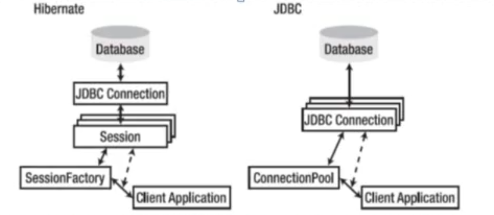
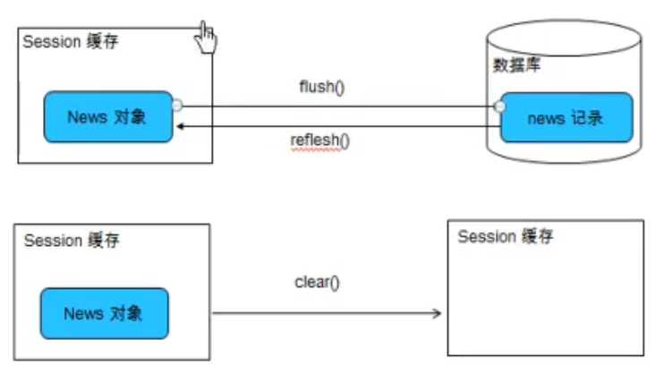
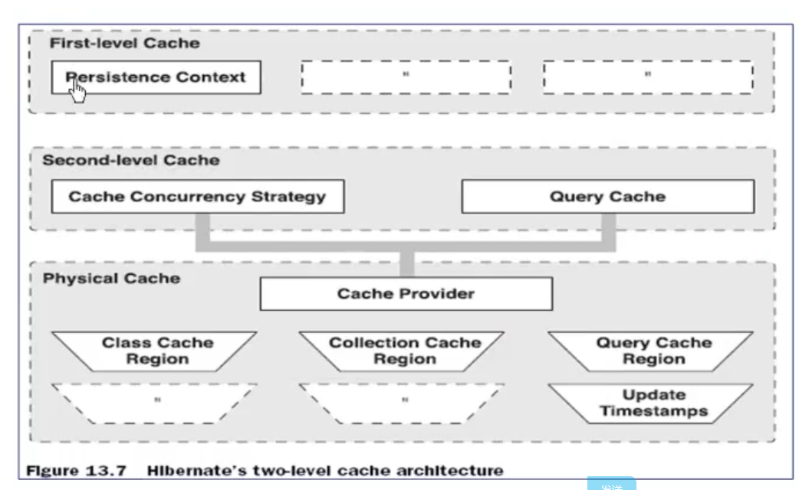
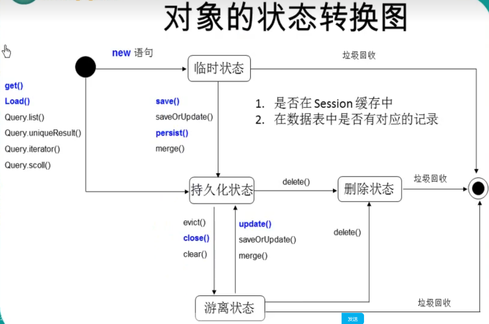
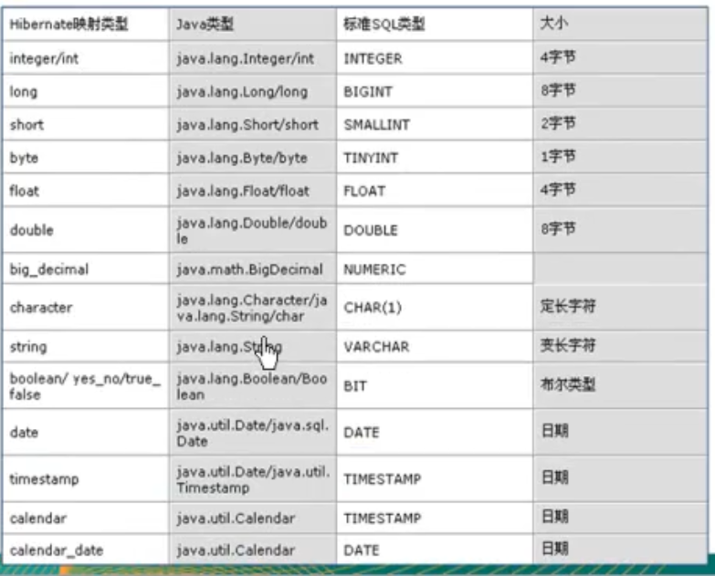
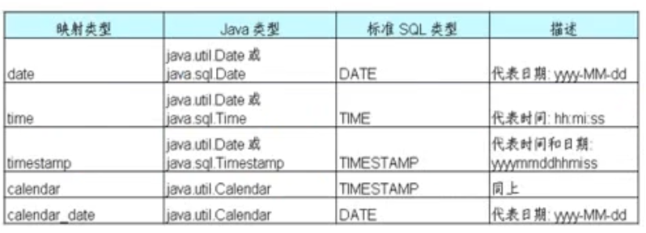
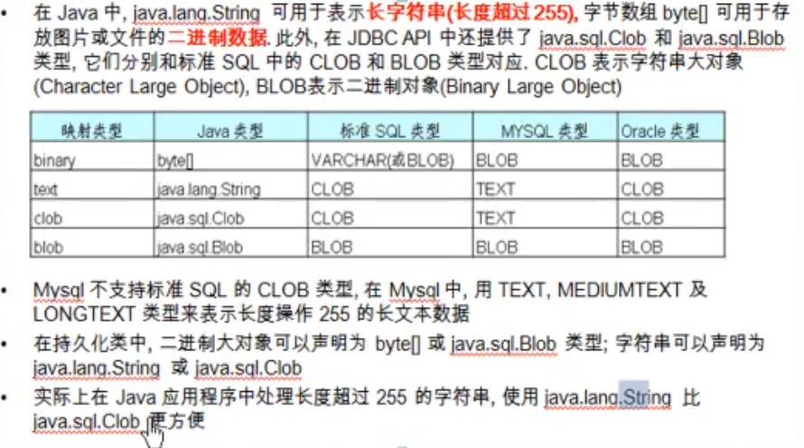
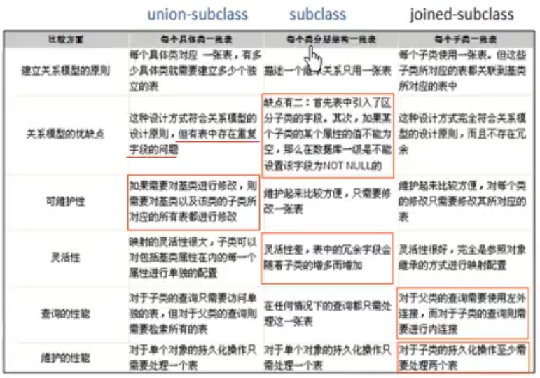

# Hibernate

version: 5

This is a learning notes from [尚硅谷佟刚Hibernate框架全套教程](https://www.bilibili.com/video/BV1KW411u7GJ?p=1)

Start: 12/08/2022

End: 16/08/2022


> **Meta Object -- 元数据**
>
> 对象-关系映射细节，通常采用XML格式，放在专门的对象-关系映射的文件中。

## Hibernate Quick Start Step 

1. Create Hibernate config file @ Root (resources there) : hibernate.cfg.xml
2. Create *.hbm.xml as the mapping file
3. Create Persistent Object
4. Java sentence

### Step1: Create hibernate.cfg.xml

#### Dependency

```xml
<dependency>
    <groupId>junit</groupId>
    <artifactId>junit</artifactId>
    <version>4.13.1</version>
    <scope>test</scope>
</dependency>
<dependency>
    <groupId>org.hibernate</groupId>
    <artifactId>hibernate-core</artifactId>
    <version>5.0.7.Final</version>
</dependency>
<dependency>
    <groupId>org.hibernate</groupId>
    <artifactId>hibernate-c3p0</artifactId>
    <version>5.6.10.Final</version>
</dependency>
<dependency>
    <groupId>mysql</groupId>
    <artifactId>mysql-connector-java</artifactId>  
    <version>5.1.19</version>
</dependency>
```

 Tips: oracle connector: ojdbc14

#### hibernate.cfg.xml

> File => Project Structure => Facets => + Hibernate => + hibernate.cfg.xml

```xml
<?xml version='1.0' encoding='utf-8'?>
<!DOCTYPE hibernate-configuration PUBLIC
    "-//Hibernate/Hibernate Configuration DTD//EN"
    "http://www.hibernate.org/dtd/hibernate-configuration-3.0.dtd">
<hibernate-configuration>
  <session-factory>
    <property name="connection.driver_class">com.mysql.jdbc.Driver</property>
    <property name="connection.url">jdbc:mysql///test_hibernate</property>
    <property name="connection.username">xxxxxxxxxx</property>
    <property name="connection.password">xxxxxxxxxx</property>
      
    <property name="show_sql">true</property>
    <property name="format_sql">true</property>
    <property name="dialect">org.hibernate.dialect.MySQL5InnoDBDialect</property>
    <property name="hibernate.hbm2ddl.auto">update</property>
      
    <property name="hibernate.c3p0.max_size">10</property>
    <property name="hibernate.c3p0.min_size">5</property>
    <property name="c3p0.acquire_increment">2</property>
    <property name="c3p0.timeout">2000</property>
    <property name="c3p0.idle_test_period">2000</property>
    <property name="c3p0.max_statements">10</property>
      
    <mapping resource="com/atguigu/hibernate/helloworld/News.hbm.xml"/>
  </session-factory>
</hibernate-configuration>
```

```xml
c3p0 pool
---------
<property name="hibernate.c3p0.max_size">10</property>
```


### Step3: Create Persistent Object from Database

> Idea : view -> Tool Windows -> Persistance
>
> ​		rightclick - > generate persistence mapping

```xml
<?xml version='1.0' encoding='utf-8'?>
<!DOCTYPE hibernate-mapping PUBLIC
    "-//Hibernate/Hibernate Mapping DTD 3.0//EN"
    "http://www.hibernate.org/dtd/hibernate-mapping-3.0.dtd">
<hibernate-mapping>

    <class name="com.example.entity.Book" table="book" schema="test_hibernate">
        <id name="id">
            <column name="ID"/>
        	<!-- Primary key generate method -->
            <generator class="native"></generator>
        </id>
        <property name="title" column="TITLE"/>
        <property name="author" column="AUTHOR"/>
        <property name="date" column="DATE"/>
    </class>
</hibernate-mapping>
```


### Step4 : Run

```java
public void test() {
    Configuration configuration = new Configuration().configure();
    SessionFactory sessionFactory = configuration.buildSessionFactory();
    Session session = sessionFactory.openSession();
    Transaction tx = session.beginTransaction();

    Book book = new Book();
    book.setDate(new Date());
    book.setAuthor("ALSOON");
    book.setTitle("Java Basic");

    session.save(book);

    tx.commit();
    session.close();
    sessionFactory.close();
}
```

**Detail:**

> Ways to call the configuration class

```java
// 1. in case the use of hibernate.properties
Configuration cfg = new Configuration();

// 2. ***The most*** in case the use of hibernate.cfg.xml
Configuration cfg = new Configuration().configure();

// 3. your customize
File file = new File("sipleit.xml");
Configuration cfg = new Configuration().configure(file);
```

> Session Factory Interface
>
> - It is thread safe
> - Normally there is only ONE session factory for one application as it is heavy when construct this.
> - To construct session
> - It is different way to build in Hibernate 3, 4, 5, Here showing 5

```java
SessionFactory sessionFactory = configuration.buildSessionFactory();
```

> Session Interface
>
> - a single thread object to do operation with database
> - have a first level cache, the operation are cached here before calling 'flush'
> - can understand as connection in JDBC



```java
Session Methods:
Get object
----------
.get(class, id); // load object immediately | return null when no object
.load(class, id); // lazy loading, which return a proxy object whild doing load(class,id), only load when the data required | throw exception when no object | throw LazyInitializationException when query after session close.

Save, Update and Delete
-----------------------
.save(Object); // insert
.persist(Object); // ditto, but if there was a ID before persist => throw exception
.update(Object);
// 1. if it is a persist object, no need to use update as tx.commit() will flush() automatically
// 2. If it is a detached object, doing update(Object) will update the data into database, by the way being save into session cache. => Tips: eventhough no changes in object, update sql will need to be executed as there has no avalable session object to compare with object. If want to avoid this set select-before-update = true(Default false) but normally no people will do that as it will be inefficient. <class ..... select-before-update="true">...
.saveOrUpdate(Object); // if id == null -> save() | if id != null -> update() | if id != null but OID not in database -> throw exception
.delete(Object); // throw exception when no id tally in database 


Transaction
-----------
.beginTransaction();

Manage Session
--------------
.isOpen();
.flush(); // flush the data from cache to database --> synchronize the object. ** only submit sql, not commit [thus no changes in database in this step] // Please note that in tx.commit(), flush() is included
.clear();
.evict(Object); // delete object in session cache so that no change to this object after execute flush
.close();

Other
-----
.doWork(Work); // do JDBC connection things such as batch insert..
```


> Transaction
>
> - All shall be done under transaction, even read only operation. Suggested.
> - The insert update delete will not be succeed without transaction commited.

```java
Transaction tx = session.beginTransaction();
```

```java
Method:
.commit();
.rollback();
.wasCommitted(); // check whether was commited.
```


## Hibernate Cache System

> Question:
>
> How hibernate know to query again if the update sql carried out?
>
> [Using timestamp (T1 query, T2 update, T3 -- T2>T1 then delete query cache data) : video 23:30 ](https://www.bilibili.com/video/BV1KW411u7GJ?p=24&vd_source=a788bdd4d7cdd9dfe02852346d523cb9)

### Level 1 Cache

> Tips: HQL and QBC does not work with level 1 cache



No sql will  be executed if there is same query in one session ==> lower pressure on io. The cache will last until:

- session end
- session cleared

> **About flush()**
>
> - only have sql, not yet commit
> - occured when :
>   - tx.commit() ==> this function will flush() first, after that only commit()
>   - manually flush() 
>   - if the cache object have been modified  (eg. setName(..)) before doing some query (HQL, Criteria)
>   - session.save() <= in case of id generator is using "native" , as it needs to know the id from database table

> **About refresh(Object)**
>
> - will execute sql to get Object when doing refresh(Object)
>
> - if it did not reflect in testing, it may be because of the isolation policy is set repeatable-read
>
>   ```java
>   Tips: to change isolation
>   -------------------------
>   in xml
>   ------
>   // 1 = read-uncommitted
>   // 2 = read-committed
>   // 3 = repeatable read
>   // 4 = serializeable
>   <property name="connection.isolation">2</property> 
>   ```

> **About clear()**
>
> - clear cache

### Level 2 Cache

> sessionFactory, which delete after sessionFactory close

> need to use plugin in order to use in Hibernate. For example, **EHcache**, OS cache, SwarmCache, JBossCache
>
> 
>
> - select one **Cache Concurrency Strategy**
>
>   - Nonstrict-read-write (Read Uncommited)
>   - **Read-Write (Most)** (Read Commited)
>   - Transaction (Repeatable Read)
>   - Read-Only (Serializable)
>
>   

> Used when:
>
> - the data with seldom update
> - the data that is not important which okay for concurrency problem (which the data might not be latest) (NOT SUITABLE FOR FINANCE RELATED DATA)

#### Step:

Dependency

```xml
<dependency>
    <groupId>org.hibernate</groupId>
    <artifactId>hibernate-ehcache</artifactId>
    <version>5.6.10.Final</version>
</dependency>
```


ehcache.xml (in resources)

> ehcache-failsafe.xml (in jar) provides a simple default configuration to enable users to get started before they create their own ehcache.xml.

```xml
<!-- below are ehcache-failsafe default -->
<ehcache> 
  <!-- edit here in case need to write it in harddisk-->
  <!-- eg. "d:\\tempDirectory" -->
  <diskStore path="java.io.tmpdir"/> 
  <!-- eternal = true == never expired, when true, ignore ttIdle and ttl Seconds -->
  <defaultCache 
     maxElementsInMemory="10000" 
     eternal="false" 
     timeToIdleSeconds="120" 
     timeToLiveSeconds="120" 
     maxElementsOnDisk="10000000" 
     diskExpiryThreadIntervalSeconds="120" 
     memoryStoreEvictionPolicy="LRU"> 
     <persistence strategy="localTempSwap"/> 
  </defaultCache> 
</ehcache>
```

customize cache setting for class / collection (will ignore default)

```xml
<ehcache>
	...
    <defaultCache ...></defaultCache>
    <cache name="com.atguigu.hibernate.entities.Employee" 
         maxElementsInMemory="10000" 
         eternal="false" 
         timeToIdleSeconds="300" 
         timeToLiveSeconds="600"
         overflowToDisk="true"
           />
    <cache name="com.atguigu.hibernate.entities.Department.emps" 
         maxElementsInMemory="10000" 
         eternal="false" 
         timeToIdleSeconds="300" 
         timeToLiveSeconds="600"
         overflowToDisk="true"
           />
    
</ehcache>
```


hibernate.xml

> for HQL and QBC query, level 2 cache is default disabled.  To enable:
>
> 1. hibernate.xml
>
>    ```xml
>    <property name="cache.use_query_cache">true</property>
>    ```
>
> 2. use Query / Criteria .setCacheable(true)
>
>    ```java
>    Query query = session.createQuery("FROM Employee");
>    query.setCacheable(true);
>             
>    List<Employee> emps = query.list();
>    System.out.println(emps.size());
>             
>    emps = query.list();
>             
>    //above case will be 2 select sql if withou the setting. however will be 1 only after setting.
>             
>    -------------------
>    example of criteria
>    -------------------
>                 
>    Criteria criteria = session.createCriteria(Employee.class);
>    criteria.setCacheable(true);
>    ```

The follow example is using session.get(...)

(A) cache for **class**

```xml
<!-- enable level 2 cache -->
<property name="cache.use_second_level_cache">true</property>
<!-- select cache -->
<property name="hibernate.cache.region.factory_class">org.hibernate.cache.ehcache.internal.EhcacheRegionFactory</property>
<!-- if found now EhcacheRegionFactory, please check the path from hibernate-ehcache jar -->

<mapping resource="person.hbm.xml"/>

<!-- select which class to enable level 2 cache -->
<!-- it also can be done in class.hbm.xml ==> inside tag <class...> <cache usage="read-only"> ... -->
<class-cache class="com.example.entity.Person" usage="read-write"/>

```

(B) cache for **collection** (set)

```xml
...

<!-- select which class to enable level 2 cache -->
<!-- it also can be done in class.hbm.xml ==> inside tag <class...> <cache usage="read-only"> ... 
<set ...> <cache usage="read-only"> ...
-->

<!-- 1. Cache One side -->
<class-cache class="com.example.entity.Department" usage="read-write"/>
<!-- [MUST, ELSE WORSER IN EFFICIENCY (MORE SQL)] 3. Cache Set element -->
<class-cache class="com.example.entity.Employee" usage="read-write"/>
<!-- 2. Cache the set -->
<collection-cache class="com.example.entity.Department.emps" usage="read-write"/>
```


Test

```java
@Test
public void testSubclassQueryWith2ndCache() {
    Person person = session.get(Person.class, 1);
    System.out.println(person.getName());

    tx.commit();
    session.close();

    session = sessionFactory.openSession();
    tx = session.beginTransaction();

    Person person1 = session.get(Person.class, 1);
    System.out.println(person1.getName());

}
```


### Extra knowledge on iterator with Cache

> more efficient with query.iterate() with eliminating more sql field using query.list()
>
> ---------------------------
>
> 1. Please ensure most of the data in Iterator has been in level 2 cache 
> 2. Only slight enhancement

```java
public void testQueryIterate() {
    Department dept = session.get(Department.class,80);
    // 1sql
    System.out.print(dept.getName());
    // 1sql
    System.out.print(dept.getEmps().size());
    
    Query query = session.createQuery("FROM Employee e WHERE e.dept.id = 80");
    // // Another sql select id, name, salary .... from employee
    // List<Employee> emps = query.list();
    // System.out.println(emps.size());
    
    // This sql: select id from employee
    // if employee already in cache exist, then no extra select sql will execute, else execute
    Iterator<Employee> empIt = query.iterate();
    
    while (empIt.hasNext()) {
        System.out.println(empIt.next().getName());
    }
    
    
}
```


## Hibernate Object Status



1. Transient (临时对象)
   - OID is null
   - not in session cache
   - no record in database
2. Persist （持久化对象)
   - OID is not null, and ID cannot be changed in this status
   - in session cache
   - if it is a record in database => tally
3. Removed (删除对象)
   - no OID from database tally with its OID
   - not in session cache
   - application shall not use object with this status anymore
4. Detached (游离对象)
   - OID not null
   - not in session cache
   - there might be one tally record from database tally with itself
   - eg. i query one object => session close , this object is a detached object


## Hibernate Config File: hibernate.cfg.xml

### Connection

```xml
<property name="connection.driver_class">com.mysql.jdbc.Driver</property>
<property name="connection.url">jdbc:mysql///test_hibernate</property>
<property name="connection.username">xxxxxxxxxx</property>
<property name="connection.password">xxxxxxxxxx</property>
```


### Connection Pool Setting

> c3p0

1. Dependency

```xml
<dependency>
    <groupId>org.hibernate</groupId>
    <artifactId>hibernate-c3p0</artifactId>
    <version>5.6.10.Final</version>
</dependency>
```

2. hibernate.cfg.xml

```xml
    <property name="hibernate.c3p0.max_size">10</property>
    <property name="hibernate.c3p0.min_size">5</property>
	<!-- the increment -->
    <property name="c3p0.acquire_increment">2</property>
    <property name="c3p0.timeout">2000</property>
	<!-- check current time vs connection time out to decide whether kill idle connection -->
    <property name="c3p0.idle_test_period">2000</property>
    <property name="c3p0.max_statements">10</property>
```


### Other

```xml

<!-- show sql sentence -->
<property name="show_sql">true</property>

<!-- formatter for sql, eg: where in next line instead of continuosly  -->
<property name="format_sql">true</property>

<!-- which sql to use, every database have some distinct sql, eg MySQL use limit while MsSQL use select top -->
<property name="dialect">org.hibernate.dialect.MySQL5InnoDBDialect</property>

<!-- Achieving generating of table in database. Option : What table structure will be in database when running .hbm.xml -->
<!-- create: the table will be recreate and start from zero while using table -->
<!-- create-drop: table will be deleted once SessionFactory is closed -->
<!-- update: [[[THE MOST]]] update the table structure using my .hbm.xml, however it does not delete the exist row and column even the structures are different -->
<!-- validate: compare with database, if .hbm.xml's column is not exist in database table, throw an exception: Missong Column -->
<property name="hibernate.hbm2ddl.auto">update</property>

<!-- which mapping file to refer -->
<mapping resource="com/atguigu/hibernate/helloworld/News.hbm.xml"/>

<!-- fetch size, eg when search 10000 record, only search according to fetch size and save temporily, and get all after repetition done. Fetch size bigger -> reduce io times, faster, but heavy | smaller -> takes longer but lesser load on memory. Oracle default 10, recommend 50 after testing (doubled in performance), 100 (+more 20%), not so obvious after that. Please be noted some database does not support this function such as MySQL. -->
<property name="hibernate.jdbc.fetch_size">100</property>

<!-- test: oracle delete 10000 = 25s in case delete 1 by 1, 5s -- batch size = 50, recommended 30 for oracle. Please be noted some database does not support this function such as MySQL-->
<property name="hibernate.jdbc.batch_size">30</property>
```


## Hibernate Mapping File: hbm.xml

> Recommend one file map one class, although it is allowed to be multiple class in one .hbm.xml

```xml
<!-- 
1. package : incase multiple class in one .hbm.xml, we can have the common package path so that it is much cleaner in setting
-->
<hibernate-mapping
      package="com.atguigu.hibernate.entities"           
                   
>	
    <!-- 
    1. name : class name eg: com......User
    2. table : table name in database
    3. dynamic-insert : default false
    4. dynamic-update : default false, eg: when I setAuthor("ABC"), the sql will only set author="ABC" instead of set author = "ABC", title="sameTitle"....
    5. select-before-update : default false, check whether same before update (which cost query before update)
    --> 
	<class name="User" table="user">
        <!-- 
        1. name : class id name
        2. type 
        3. column : id field in database table
        4. unsaved-value : default false
        5. access
        6. node
        7. length
       	--> 
        <id name="id" type="java.lang.Integer">
            <column name="ID"/>
            <generator class=".."/>
        	<!-- 
            1. native -- database method | identity > sequence > hilo
            2. increment -- hibernate will read the max primary key, and insert = max(id) + 1 （thus have concurrency problem), and the type shall be long, int or short
            3. identity -- do auto_increment in database, auto_increment supported database: DB2, MySQL, MsSQL, Sybase... Oracle do not support, and the type shall be long, int or short
            4. sequence -- DB2 or Oracle. Please be noted that MySQL does not support it. and the type shall be long, int or short
            5. hilo -- using algorithm, every db can use as it does not rely on database
       		--> 
        </id>
        <!-- 
        1. name
        2. type: if did not defined, hibernate will do reflection to get the type
        3. column
        4. access: dafault -> property, using getter and setter to visit member field. If set to "field", hibernate will use reflect to visit member field.
        5. unique: default false, whether this column is unique
        6. update: default true, whether this column can be modified
        7. index: string index to increase the speed of searching
        8. length: limiting the length
        9. scale: how many decimal place, to use with double, float, decimal
        10. formula: create a sql, hibernate will use it to generate a field value. **must accompanied with ()
       	--> 
        <property name="title" type="java.lang.String">
        	<column name="TITLE"/>
        </property>
        <!-- example of formula -->
        <!-- desc is a field in Book Class, not a field in database table -->
        <property name="desc" formula="(select concat(author, ': ', title) from book where book.id = id)"></property>
    </class>
</hibernate-mapping>

```

### Type







```xml
setting exact type
------------------
<property name="content">
	<column name="CONTENT" sql-type="mediumtext"></column>
</property>
<property name="image">
	<column name="IMAGE" sql-type="mediumblob"></column>
</property>
```


### Work with 2 Classes in 1 Table

> We can have 2 classes,  eg 'A' class have field B class. However, only **1 table** in database
>
> - higher efficiency in searching
> - class B can be used with different class --> minimize the code

```xml
<class ...>
	<id ...>
    </id>
    <property ...>
    </property>
    <!-- class: which class to map to -->
    <component name="pay" class="Pay"> 
    	<property name="monthlyPay" column="MONTHLY_PAY"></property>
    	<property name="yearPay" column="YEAR_PAY"></property>
    </component>
</class>
```


###  Work with Multiple Table (Relationship)

#### 1. Single way 1-n

> Many to one
>
> Table 1
>
> order_id | order_name | customer_id
>
> Table 2 *** be noted it is default by lazy load.
>
> customer_id | customer_name

```xml
Customer's hbm.xml
------------------
<hibernate-mapping package="com.example.entity">

    <class name="Customer" table="customer" schema="test_hibernate">
        <id name="customerId">
            <column name="ID"/>
            <generator class="native"></generator>
        </id>
        <property name="customerName" column="CUSTOMER_NAME"/>
    </class>
</hibernate-mapping>
```

```xml
Order's hbm.xml
------------------
<hibernate-mapping package="com.example.entity">

    <class name="Order" table="orders" schema="test_hibernate">
        <id name="orderId">
            <column name="ID"/>
            <generator class="native"></generator>
        </id>
        <property name="orderName" column="ORDER_NAME"/>
        <!--- ************** -->
        <many-to-one name="customer" class="Customer" column="CUSTOMER_ID"/> 
    </class>
</hibernate-mapping>
```

```java
    @Test
    public void testManyToOne() {
        
        // save 1 point first, then n point
        // in this case, 3 insert sql

        Customer customer = new Customer();
        customer.setCustomerName("Hello");
        session.save(customer);

        Order order1 = new Order();
        order1.setOrderName("Order 1");
        order1.setCustomer(customer);

        Order order2 = new Order();
        order2.setOrderName("Order 2");
        order2.setCustomer(customer);

        session.save(order1);
        session.save(order2);
        
        /*
        if:
        session.save(order1);
        session.save(order2);
        session.save(customer);
        will happen: 3 insert, 2 update, which actually when inserting order1&2, the customer Id will be first set null.
        */
    }
```


#### 2. Both-ways 1-n

> Both class have one field for each other
>
> Customer Class:
>
> Set\<Order> orderSet;  *** be noted it is default by lazy load, it is a Hibernate Set Proxy when using get()
>
> Order Class:
>
> Customer customer

```xml
Customer's hbm.xml
------------------
<hibernate-mapping package="com.example.entity">

    <class name="Customer" table="customer" schema="test_hibernate">
        <id name="customerId">
            <column name="ID"/>
            <generator class="native"></generator>
        </id>
        <property name="customerName" column="CUSTOMER_NAME"/>
		<!-- ********** -->
        <!-- inverse="true" ==> this will give up to manage relationship so to eliminate additional update sql -->
        <!-- Do not recommend to use cascade, this is just for your information -->
        <!-- cascade="delete" ==> 级联删除, while session.delete(customer), then order with this customer will be deleted as well -->
        <!-- cascade="delete-orphan" ==> while customer.getOrder().clear(), the order with this customer will be deleted -->
        <!-- cascade="save-update" ==> while session.save(customer), the order in customer's set will be update and save as well -->
        <set name="orderSet" table="orders">
            <key column="CUSTOMER_ID"/>
            <one-to-many class="Order"/>
        </set>
    </class>
</hibernate-mapping>
```

```java
@Test
public void testManyToOne() {

    // in this case, 3 insert sql + 2 update sql ****** lower efficiency than one way
    
    Customer customer = new Customer();
    customer.setCustomerName("Hello");

    Order order1 = new Order();
    order1.setOrderName("Order 1");

    Order order2 = new Order();
    order2.setOrderName("Order 2");

    order1.setCustomer(customer);
    order2.setCustomer(customer);

    customer.getOrderSet().add(order1);
    customer.getOrderSet().add(order2);

    session.save(customer);
    session.save(order1);
    session.save(order2);
}
```

Tips:

> We can eliminate the update sql by settomg inverse="true" @ 1 hbm.xml, it means that 1 will not manage the relationship

```xml
<set name="orderSet" table="orders" inverse="true">
    <key column="CUSTOMER_ID"/>
    <one-to-many class="Order"/>
</set>
```


#### 3. Both-way one - one --- using foreign key

> Manager class fields: id, name, department
>
> Department class fields: id, name, manager
>
> Table 1: dept_id | dept_name | manager_id
>
> Table 2: manager_id | manager_name

```xml
manager.hbm.xml
---------------
<hibernate-mapping package="com.example.entity">

    <class name="Manager" table="manager" schema="test_hibernate">
        <id name="id">
            <column name="MANAGER_ID"/>
            <generator class="native"></generator>
        </id>
        <property name="name" column="MANAGER_NAME"/>
        <!-- MUST: property-ref here means when we query, the id will be where compared with department.manager_id instead of department.department_id --> 
        <one-to-one name="department" class="Department" property-ref="manager"/>
    </class>
</hibernate-mapping>
```

```xml
department.hbm.xml
------------------
<hibernate-mapping package="com.example.entity">

    <class name="Department" table="department" schema="test_hibernate">
        <id name="id">
            <column name="DEPT_ID"/>
            <generator class="native"></generator>
        </id>
        <property name="name" column="DEPARTMENT_NAME"/>
        <!-- unique="true" to make sure it is one-to-one with another table -->
        <many-to-one name="manager" class="Manager" column="MANAGER_ID" unique="true"/>
    </class>
</hibernate-mapping>
```

```java
@Test
public void oneToOneSave() {
    Manager manager = new Manager();
    manager.setName("manager A");

    Department department = new Department();
    department.setName("dept A");

    manager.setDepartment(department);
    department.setManager(manager);
	
    // two insert sql were executed here, if the sequence is upside down -> one addition update sql
    // thus, recommend save the item without foreign key (in this case: manager) first
    session.save(manager);
    session.save(department);
}
```

Tips: be noted that when we query manager, the department will be query also since left join was used. (In hibernate)

#### 4. Both-ways one to one -- using primary key

> Manager class fields: id, name, department
>
> Department class fields: id, name, manager
>
> Table 1: dept_id | dept_name
>
> Table 2: manager_id | manager_name

```xml
manager.hbm.xml
---------------
<hibernate-mapping package="com.example.entity">

    <class name="Manager" table="manager" schema="test_hibernate">
        <id name="id">
            <column name="MANAGER_ID"/>
            <generator class="native"></generator>
        </id>
        <property name="name" column="MANAGER_NAME"/>
        <!-- do not put property-ref -->
        <one-to-one name="department" class="Department"/>
    </class>
</hibernate-mapping>
```

```xml
department.hbm.xml
------------------
<hibernate-mapping package="com.example.entity">

    <class name="Department" table="department" schema="test_hibernate">
        <id name="id">
            <column name="DEPT_ID"/>
            <!-- important -->
            <generator class="foreign">
                <!-- manager is a field in class department -->
                <param name="property">manager</param>
            </generator>
        </id>
        <property name="name" column="DEPARTMENT_NAME"/>
        <!-- constrained to make a foreign key to manager_id -->
        <one-to-one name="manager" class="Manager" constrained="true"/>
    </class>
</hibernate-mapping>
```

```java
@Test
public void oneToOneSave() {
    Manager manager = new Manager();
    manager.setName("manager C");

    Department department = new Department();
    department.setName("dept C");

    manager.setDepartment(department);
    department.setManager(manager);
	
    // even if upside-down, there will be only 2 insert sql (manager first --> department next)
    session.save(manager);
    session.save(department);
}

```


#### 5. Single way Many to many

> Categories class with fields: id, name, item
>
> Item class with fields: id, name
>
> Table Category : id | name
>
> Table Item : id | name
>
> Table relationship : C_ID | I_ID

```xml
category.hbm.xml
----------------
<hibernate-mapping package="com.example.entity">

    <class name="Category" table="CATEGORY" schema="test_hibernate">
        <id name="id">
            <column name="ID"/>
            <generator class="native"/>
        </id>
        
        <property name="name" column="NAME"/>
        
        <!-- table: relationship table -->
        <set name="items" table="CATEGORY_ITEM">
            <key>
                <column name="C_ID"/>
            </key>
            <!-- column: the column name (ID) of the other table -->
            <many-to-many class="Item" column="I_ID"/>
            <!-- in this case , relationship table will be C_ID | I_ID -->
        </set>
        
    </class>
    
</hibernate-mapping>
```

```xml
item.hbm.xml
------------
<hibernate-mapping package="com.example.entity">
    <class name="Item" table="ITEM" schema="test_hibernate">
        
        <id name="id">
            <column name="ID"/>
            <generator class="native"/>
        </id>
        
        <property name="name" column="NAME"/>
        
    </class>
    
</hibernate-mapping>
```

```java
@Test
public void manyToManySave1() {
    Item item1 = new Item();
    item1.setName("I3");

    Item item2 = new Item();
    item2.setName("I4");

    Category category1 = new Category();
    category1.setName("C3");
    category1.getItems().add(item1);
    category1.getItems().add(item2);

    Category category2 = new Category();
    category2.setName("C4");
    category2.getItems().add(item1);
    category2.getItems().add(item2);

    session.save(item1);
    session.save(item2);

    session.save(category1);
    session.save(category2);
    
    // in this case: 2 insert sql for item2, 2 insert sql for categories, 4 insert sql for relationship table (category_item)

}
```

Tips:

if we get category.items [set] => sql is inner join


#### 6. Both-ways Many -To-Many

> Categories class with fields: id, name, item
>
> Item class with fields: id, name, categories
>
> Table Category : id | name
>
> Table Item : id | name
>
> Table relationship : C_ID | I_ID

Overall same with one way, just either set in hbm.xml must be inverse="true", else might happen dispute in primary key, which because of both table is managing the relationship.

```xml
category.hbm.xml
----------------
<hibernate-mapping package="com.example.entity">

    <class name="Category" table="CATEGORY" schema="test_hibernate">
        <id name="id">
            <column name="ID"/>
            <generator class="native"/>
        </id>
        
        <property name="name" column="NAME"/>
        
        <!-- table: relationship table -->
        <set name="items" table="CATEGORY_ITEM">
            <key>
                <column name="C_ID"/>
            </key>
            <!-- column: the column name (ID) of the other table -->
            <many-to-many class="Item" column="I_ID"/>
            <!-- in this case , relationship table will be C_ID | I_ID -->
        </set>
        
    </class>
    
</hibernate-mapping>
```

```xml
item.hbm.xml
------------
<hibernate-mapping package="com.example.entity">
    <class name="Item" table="ITEM" schema="test_hibernate">
        
        <id name="id">
            <column name="ID"/>
            <generator class="native"/>
        </id>
        
        <property name="name" column="NAME"/>
        
        <!-- ****** inverse="true" -->
        <set name="categories" table="CATEGORY_ITEM"  inverse="true">
            <key>
                <column name="C_ID"/>
            </key>
            <many-to-many class="Category" column="I_ID"/>
        </set>
        
    </class>
    
</hibernate-mapping>
```


### Work with Inheritance Mapping (seldom used)

#### Using subclass (seldom used as no unique constraint can be added for subclass)

> Class Person : id, name, age
>
> Class Student (Extend Person): school
>
> Table (ONE ONLY)
>
> | ID   | TYPE    | PERSON_NAME | AGE  | SCHOOL  |
> | ---- | ------- | ----------- | ---- | ------- |
> | 1    | PERSON  | AA          | 12   | (NULL)  |
> | 2    | STUDENT | BB          | 13   | ATGUIGU |

> **Weakness**
>
> 1. Consume one more colum for type (Discriminator)
> 2. Subclass's column cannot add constraint -- Unique

```xml
<hibernate-mapping package="com.example.entity">

    <!-- add discriminator-value -->
    <class name="Person" table="person" schema="test_hibernate" discriminator-value="PERSON">

        <id name="id">
            <column name="ID"/>
            <generator class="native"/>
        </id>

        <!-- discriminator column -->
        <discriminator column="TYPE" type="string"></discriminator>

        <property name="name" column="NAME"/>

        <property name="age" column="AGE"/>

        <subclass name="Student" discriminator-value="STUDENT">
            <property name="school" type="string" column="SCHOOL"/>
        </subclass>
    </class>

</hibernate-mapping>
```

```java
@Test
public void testSubclass() {
    Person person = new Person();
    person.setAge(18);
    person.setName("AAAAA");


    Student student = new Student();
    student.setName("ABC");
    student.setAge(22);
    student.setSchool("Atguigu");

    session.save(person);
    session.save(student);
}
```

Tips: test query

```java
@Test
public void testSubclassQuery() {
    List from_person = session.createQuery("FROM Person").list();
    System.out.println(from_person.size()); //2

    List from_student = session.createQuery("FROM Student ").list();
    System.out.println(from_student.size()); //1
}
```


#### Using Joined-Subclass

> Class Person : id, name, age
>
> Class Student (Extend Person): school
>
> Table -- every subclass have one table
>
> Table person | ID | NAME | AGE |
>
> Table student | ID | School |
>
> -- Quite same case with one-to-one with same primary case. However, this is subclass
>
> -- subclass id's foreign key is superclass id 
>
> **Weakness**
>
> 1. need to execute sql more when doing subclass insert / etc as need to update superclass too.
> 2. use left join / inner join when query
>
> **Strength**
>
> 1. no discriminator
> 2. Subclass column can be unique
> 3. lower redundancy

```xml
<hibernate-mapping package="com.example.entity">

    <class name="Person" table="person" schema="test_hibernate">

        <id name="id">
            <column name="ID"/>
            <generator class="native"/>
        </id>

        <property name="name" column="NAME"/>

        <property name="age" column="AGE"/>

        <joined-subclass name="Student" table="STUDENT">
            <key column="STUDENT_ID"></key>
            <property name="school" type="string" column="SCHOOL"></property>
        </joined-subclass>
    </class>

</hibernate-mapping>
```


#### Use Union-Subclass (the most used if used inheritance mapping)

>Split the table entirely
>
>Class Person : id, name, age
>
>Class Student (Extend Person): school
>
>Table -- every subclass have one table
>
>Table person | ID | NAME | AGE |
>
>Table student | ID | NAME | AGE | SCHOOL
>
>**Weakness**
>
>1. Bad in superclass query as need to query subclass as well : select ... from select ... persons union select ... student
>2. High redundancy in columns
>3. involved in multiple SQL when updating superclass, as need to update in subclass table and superclass table eg update person p set p.age = 20
>
>**Strength**
>
>1. Good in subclass query
>2. No discriminator column
>3. Subclass field add constraint : NULL
>
>

```xml
<hibernate-mapping package="com.example.entity">

    <class name="Person" table="person" schema="test_hibernate">

        <id name="id">
            <column name="ID"/>
            <generator class="native"/>
        </id>

        <property name="name" column="NAME"/>

        <property name="age" column="AGE"/>

        <union-subclass name="Student" table="STUDENT">
            <property name="school" type="string" column="SCHOOL"/>
        </union-subclass>
        
    </class>

</hibernate-mapping>
```

Tips: error

`org.hibernate.MappingException: Cannot use identity column key generation with <union-subclass> mapping for: com.example.entity.Student`

#### Summary




## Hibernate Search Strategies

> We can use Hibernate.initialize(customer.getOrder()); to load class immediately even if Lazy=true


Always looking for:

1. waste no memory, the data that we do not want we do not query
2. lesser sql executed.

However, they are always opposition with each other. 

---------------------

### Strategy of one table

> for tag `class`, attribute:
>
> `lazy="false"` -- when calling load(), then the object will be loaded. Used when we load to use the object's field
>
> `lazy="true"` (default) -- when calling load(), object will not be loaded until we call the field in this object. Used when we load to get the reference.

However, be noted that using session.get(...) will always do immediate search. So, in order to use lazy load, do use session.load(...)


-----------------------------------

**Strategy of one-to-many, and many-to-many**

> For tag `set`, attribute:
>
> `lazy="false"` -- not recomended, as it will send **multiple sql for different tables**, and memory is occupied by 2 objects as well.
>
> `lazy="true"` (default)  -- execute sql and load object only when the object's field was used.
>
> `lazy="extra"` -- maximize the delay for loading object , eg when we use customer.getOrders().size(), it does not load customer yet, it use sql select count(..)..... instead.
>
> ----------------------
>
> `batch-size="2"` -- the setting of size of initialization object. eg, for(customer in [4customers]) customer.getName() --> 2 query sql will be executed if batch-size="2", 1 query sql with batch-size="5" (sql: in (.., .., .., ..))
>
> -----------------------------
>
> `fetch="select"` (default) -- normal execution
>
> `fetch="subselect"` -- will use where C_ID in (select id from ....) => load **all** object, ignore batch-size
>
> `fetch="join"` -- ignore lazy, use **LEFT JOIN** to query the objects and its set objects. Please be noted that using HQL.list() will still use lazy.

---------------------------

**Strategy of many-to-one, and one-to-one**

> For tag `many-to-one`, attribute:
>
> `lazy='false'` `lazy='proxy'` 
>
> `fetch='join'`

> For tag `class` (one side), attribute:
>
> `batch-size="x"`


Tips: 

the use of iterator(), size(), isEmpty(), contains() in collections will trigger the initialization of object if using lazy=true.

the use of iterator() will trigger the initialization of object if using lazy=extra, however, size(), contains(), and isEmpty() will not.


## Hibernate Query Method

> Pleas be noted "FROM XXX" <= XXX is the entity instead of table name in your database

1. Navigation object graph retrieval method : eg order.getCustomers(), order have a field : customer
2. OID eg session.get(class, 1);
3. HQL retrieval method **[IMPORTANT!]**  
4. QBC retrieval method (Query By Criteria)
5. Local SQL retrieval method

-----------------------------

### HQL

#### HQL Example

```java
@Test
public void testHQL() {
    
    --------
    Method 1
    --------
    String hql = "FROM Employee e WHERE e.salary > ? AND e.email LIKE ? AND e.dept = ? ORDER BY e.salary";
    
    //Create Query
    Query query = session.createQuery(hql);
    
    // Bind param
    Department dept = new Department();
    dept.setId(80);
    query.setFloat(0, 6000)
         .setString(1,"%a%")
         .setEntity(2, dept);
    
    --------
    Method 2
    --------
    
    String hql = "FROM Employee e WHERE e.salary > :sal AND e.email LIKE :email AND e.dept = :dept ORDER BY e.salary";
    
    //Create Query
    Query query = session.createQuery(hql);
    
    // Bind param
    Department dept = new Department();
    dept.setId(80);
    query.setFloat("sal", 6000)
         .setString("email","%a%")
         .setEntity("dept", dept);
    
    ----------
    
    // execute
    List<Employee> emps = query.list();
    System.out.println(emps.size());
}
```


#### HQL Pagination

** .setFirstResult(theFirstResult)

** .setMaxResults(pageSize)

```java
@Test
public void testPageQuery() {
    String hql = "FROM Employee";
    Query query = session.createQuery(hql);
    
    int pageNo = 22;
    int pageSize = 5;
    
    List<Employee> emps = query.setFirstResult((pageNo - 1) * pageSize)
        					 .setMaxResults(pageSize)
        					 .list();
    
    System.out.println(emps);
}
```


#### HQL 命名查询 (save the hql in hbm.xml)

** .getNamedQuery(name)

```xml
<hibernate-mapping>
	<class>
        ...
    </class>
    <query name="salaryEmps">
    	<![CDATA[FROM Employee e WHERE e.salary > :minSal AND e.salary < :maxSal]]>
    </query>
</hibernate-mapping>
```

```java
@Test
public void testHQL() {
    Query query = session.getNamedQuery("salaryEmps");
    
    List<Employee> emps = query.setFloat("minSal", 5000)
        					 .setFloat("maxSal", 10000)
        					 .list();
    
    System.out.println(emps.size());
}
```


#### HQL 投影查询( only select required column)

** be noted default return is Object[]

```java
@Test
public void testHQL() {
    String hql = "SELECT e.email, e.salary, e.dept FROM Employee e WHERE e.dept = :dept";
    Query query = session.createQuery(hql);
    
    Department dept = new Department();
    dept.setId(80);
    List<Object[]> result = query.setEntity("dept", dept)
        					   .list();
    
    for (Object[] obs: result) {
        System.out.println(Arrays.asList(objs));
    }
}
```

----

or return the List<Employee>

```java
@Test
public void testHQL() {
    // PLEASE BE NOTED THAT THERE SHALL BE A CONSTRUCTOR FOR EMPLOYEE WITH FOLLOWING SEQUENCE PARAM
    String hql = "SELECT new Employee(e.email, e.salary, e.dept) FROM Employee e WHERE e.dept = :dept";
    Query query = session.createQuery(hql);
    
    Department dept = new Department();
    dept.setId(80);
    List<Employee> result = query.setEntity("dept", dept)
        					   .list();
    
    for (Employee emp : result) {
        System.out.println(emp.getId() + " " + emp.getEmail() + " " + emp.getSalary() + " " + e.getDept);
    }
    // return : null abc@gmail.com 12000 Department [id=80, name=Sales]
}
```


#### HQL 报表查询 (GroupBy ... Having....)

`count()` `min()` `max()` `sum()` `avg()` 

```java
@Test
public void testHQL() {
    String hql = "SELECT min(e.salary), max(e.salary) FROM Employee e"
        		+ "GROUP BY e.dept"
        		+ "HAVING min(salary) > :minSal";
    Query query = session.createQuery(hql);
    List<Object[]> result = query.setFloat("minSal", 5000)
        					   .list();
    
    for (Object[] obs: result) {
        System.out.println(Arrays.asList(objs));
    }
}
```


#### Left Join Fetch | Inner Join Fetch

> If there is no selecting query strategy in HQL, then refer to hbm.xml
>
> HQL will ignore hbm.xml fetch setting, it means you shall be explicitly use LEFT JOIN FETCH in HQL.

```java
// All employee here has been initialized
// use SELECT DISTINCT or new ArrayList(new LinkedHashSet(result)) to delete the duplicate

@Teat
public void leftJoinFetch() {
    // String hql = "SELECT DISTINCT d FROM Department d LEFT JOIN FETCH d.emps"
    String hql = "FROM Department d LEFT JOIN FETCH d.emps";
    Query query = session.createQuery(hql);
    
    List<Department> depts = query.list();
    depts = new ArrayList<>(new LinkedHashSet(depts));
    System.out.println(depts.size());
    
    for (Department dept : depts) {
        System.out.println(dept.getName() + "-" + dept.getEmps().size());
    }
}

-------------------------------
WITHOUT FETCH (WE DONT USE IT!)
-------------------------------

// list() return Object[] ==> new ArrayList(new LinkedHashSet(result)) not working.
// employee only initialized when used
@Teat
public void leftJoinFetch() {
    String hql = "SELECT DISTINCT d FROM Department d LEFT JOIN FETCH d.emps"
    Query query = session.createQuery(hql);
    
    List<Department> depts = query.list();
    
    for (Department dept : depts) {
        System.out.println(dept.getName() + "-" + dept.getEmps().size());
    }
}
```


### QBC (Query By Criteria)

> Not recommend to use in query multi table 

```java
@Test
public void testQBC() {
    //1. Create Criteria
    Criteria criteria = session.createCriteria(Employee.class);
    
    //2. Set Criteria
    criteria.add(Restriction.eq("email","SKUMAR"));
    criteria.add(Restriction.gt("salary", 5000F));
    
    //3. Execute
    Employee employee = criteria.uniqueResult();
    
    System.out.println(employee);
}

---
AND
---
@Test
public void testQBCAnd() {
    //1. Create Criteria
    Criteria criteria = session.createCriteria(Employee.class);
    
    //2. Set Criteria
    Conjunction conjunction = Restriction.conjunction();
    conjunction.add(Restriction.like("name", "a", MatchMode.ANYWHERE));
    conjunction.add(Restriction.eqProperty("dept", dept));
    
    criteria.add(conjunction);
    
    //3. Execute
    criteria.list();
}

---
OR
---
@Test
public void testQBCAnd() {
    //1. Create Criteria
    Criteria criteria = session.createCriteria(Employee.class);
    
    //2. Set Criteria
    Disjunction disjunction = Restriction.disjunction();
    disjunction.add(Restriction.ge("sal", 6000F);
    disjunction.add(Restriction.isNotNull("email"));
    
    criteria.add(disjunction);
                    
    //3. Execute
    criteria.list();
}
                    
// if AND or OR example used together => (..  AND ..) AND (.. OR ..)
```

```java
criteria.add(Restriction...)
criteria.add(Projection...)
criteria.add(Order...)
criteria.add(conjunction)
criteria.add(disjunction)
criteria.setFirstResult((pageNo - 1) * pageSize);
criteria.setMaxResults(pageSize);
criteria.list();
```

条件查询 

```java
Restriction.eq(column,value);
Restriction.gt(column,value);
Restriction.isNotNull(column);
Restriction.like(column,value, MatchMode.);
Restriction.qeProperty(ObjectName,object);
```

统计查询 (Statictic)

```java
Projection.max(column);
```

排序 (Order By)

```java
Order.asc(column);
Order.desc(column);
```


### Local SQL

**Update:**

```java
public void testNativeSQL() {
    String sql = "INSERT INTO gg_department VALUES(?,?)"
    Query query = session.createSQLQuery(sql);
    
    query.setInteger(0, 280)
         .setString(1, "ATGUIGU")
         .executeUpdate();
}
```


## Batch Execute

Tips: recommend JDBC method for batch as it is most efficient

```java
public void testBatch() {
    session.doWork(conn -> {
         PreparedStatement pstmt = null;
          try{
           String sqlInsert = "insert into sampletbl (name) values (?) ";
           pstmt = conn.prepareStatement(sqlInsert );
           int i=0;
           for(String name : list){
               pstmt .setString(1, name);
               pstmt .addBatch();

               //20 : JDBC batch size
             if ( i % 20 == 0 ) { 
                pstmt .executeBatch();
              }
              i++;
           }
           pstmt .executeBatch();
         }
         finally{
           pstmt .close();
         }     
    })
}
```

Other (Not recommended) [reason : 16:25](https://www.bilibili.com/video/BV1KW411u7GJ?p=25&spm_id_from=pageDriver&vd_source=a788bdd4d7cdd9dfe02852346d523cb9): 

1. Session
2. HQL
3. StatelessSession


## HibernateUtil

1. in hibernate.xml

   ```xml
   <property name="current_session_context_class">thread</property>
   ```

2. HibernateUtil.class

   [Refer here, This is quite good](https://www.javatips.net/api/sample-skeleton-projects-master/JPA/src/main/java/com/jpa/util/HibernateUtil.java)


## Other tips

### Import img into database (Seldom, normally we save path)

```java
InputStream is = new FileInputStream("...");
Blob image = Hibernate.getLobCreator(session).createBlob(is, is.available());
book.setImage(image);

session.save(book);
```

### Exporting blob from database (Seldom, normally we save path)

```java
Book book = session.get(Book.class, 1);
Blob image = book.getImage();
InputStream is = image.getBinaryStream();
...
```

### Insert into new table from old table data

```sql
insert into new_employees select employee_id, last_name, salary, email, department_id from employees;
```

### Lazy Reference for Query

```java
Query = session.createQuery(hql); // hql
Query = session.createSQLQuery(sql); //sql
Query = session.getNamedQuery("in hbm.xml");

query.setInteger(index/:, value);
query.setString(index/:, value);
query.setFloat(index/:, value);
query.setEntity(index/:, value);
Iterator<?> = query.iterate();

query.setFirstResult((pageNo - 1) * pageSize);
query.setMaxResults(pageSize);

query.executeUpdate(); // use in sql / hql with delete also
query.list();
```


### For my reference

##### ehcache-failsafe.xml

```xml
<ehcache xmlns:xsi="http://www.w3.org/2001/XMLSchema-instance" xsi:noNamespaceSchemaLocation="../config/ehcache.xsd">

    <!--
    The ehcache-failsafe.xml is a default configuration for ehcache, if an ehcache.xml is not configured.

    The diskStore element is optional. It must be configured if you have overflowToDisk or diskPersistent enabled
    for any cache. If it is not configured, a warning will be issues and java.io.tmpdir will be used.

    diskStore has only one attribute - "path". It is the path to the directory where .data and .index files will be created.

    If the path is a Java System Property it is replaced by its value in the
    running VM.

    The following properties are translated:
    * user.home - User's home directory
    * user.dir - User's current working directory
    * java.io.tmpdir - Default temp file path
    * ehcache.disk.store.dir - A system property you would normally specify on the command line
          e.g. java -Dehcache.disk.store.dir=/u01/myapp/diskdir ...

    Subdirectories can be specified below the property e.g. java.io.tmpdir/one

    -->
    <diskStore path="java.io.tmpdir"/>

    <!--
    Specifies a CacheManagerEventListenerFactory, be used to create a CacheManagerPeerProvider,
    which is notified when Caches are added or removed from the CacheManager.

    The attributes of CacheManagerEventListenerFactory are:
    * class - a fully qualified factory class name
    * properties - comma separated properties having meaning only to the factory.

    Sets the fully qualified class name to be registered as the CacheManager event listener.

    The events include:
    * adding a Cache
    * removing a Cache

    Callbacks to listener methods are synchronous and unsynchronized. It is the responsibility
    of the implementer to safely handle the potential performance and thread safety issues
    depending on what their listener is doing.

    If no class is specified, no listener is created. There is no default.

    <cacheManagerEventListenerFactory class="" properties=""/>
    -->

    <!--
    (Enable for distributed operation)

    Specifies a CacheManagerPeerProviderFactory which will be used to create a
    CacheManagerPeerProvider, which discovers other CacheManagers in the cluster.

    The attributes of cacheManagerPeerProviderFactory are:
    * class - a fully qualified factory class name
    * properties - comma separated properties having meaning only to the factory.

    Ehcache comes with a built-in RMI-based distribution system with two means of discovery of
    CacheManager peers participating in the cluster:
    * automatic, using a multicast group. This one automatically discovers peers and detects
      changes such as peers entering and leaving the group
    * manual, using manual rmiURL configuration. A hardcoded list of peers is provided at
      configuration time.

    Configuring Automatic Discovery:
    Automatic discovery is configured as per the following example:
    <cacheManagerPeerProviderFactory
                        class="net.sf.ehcache.distribution.RMICacheManagerPeerProviderFactory"
                        properties="peerDiscovery=automatic, multicastGroupAddress=230.0.0.1,
                                    multicastGroupPort=4446, timeToLive=32"/>

    Valid properties are:
    * peerDiscovery (mandatory) - specify "automatic"
    * multicastGroupAddress (mandatory) - specify a valid multicast group address
    * multicastGroupPort (mandatory) - specify a dedicated port for the multicast heartbeat
      traffic
    * timeToLive - specify a value between 0 and 255 which determines how far the packets will propagate.
      By convention, the restrictions are:
      0   - the same host
      1   - the same subnet
      32  - the same site
      64  - the same region
      128 - the same continent
      255 - unrestricted


    Configuring Manual Discovery:
    Manual discovery is configured as per the following example:
    <cacheManagerPeerProviderFactory class=
                          "net.sf.ehcache.distribution.RMICacheManagerPeerProviderFactory"
                          properties="peerDiscovery=manual,
                          rmiUrls=//server1:40000/sampleCache1|//server2:40000/sampleCache1
                          | //server1:40000/sampleCache2|//server2:40000/sampleCache2"/>

    Valid properties are:
    * peerDiscovery (mandatory) - specify "manual"
    * rmiUrls (mandatory) - specify a pipe separated list of rmiUrls, in the form
                            //hostname:port

    The hostname is the hostname of the remote CacheManager peer. The port is the listening
    port of the RMICacheManagerPeerListener of the remote CacheManager peer.

    <cacheManagerPeerProviderFactory
            class="net.sf.ehcache.distribution.RMICacheManagerPeerProviderFactory"
            properties="peerDiscovery=automatic,
                        multicastGroupAddress=230.0.0.1,
                        multicastGroupPort=4446, timeToLive=1"/>
    -->

    <!--
    (Enable for distributed operation)

    Specifies a CacheManagerPeerListenerFactory which will be used to create a
    CacheManagerPeerListener, which
    listens for messages from cache replicators participating in the cluster.

    The attributes of cacheManagerPeerListenerFactory are:
    class - a fully qualified factory class name
    properties - comma separated properties having meaning only to the factory.

    Ehcache comes with a built-in RMI-based distribution system. The listener component is
    RMICacheManagerPeerListener which is configured using
    RMICacheManagerPeerListenerFactory. It is configured as per the following example:

    <cacheManagerPeerListenerFactory
        class="net.sf.ehcache.distribution.RMICacheManagerPeerListenerFactory"
        properties="hostName=fully_qualified_hostname_or_ip,
                    port=40001,
                    socketTimeoutMillis=120000"/>

    All properties are optional. They are:
    * hostName - the hostName of the host the listener is running on. Specify
      where the host is multihomed and you want to control the interface over which cluster
      messages are received. Defaults to the host name of the default interface if not
      specified.
    * port - the port the listener listens on. This defaults to a free port if not specified.
    * socketTimeoutMillis - the number of ms client sockets will stay open when sending
      messages to the listener. This should be long enough for the slowest message.
      If not specified it defaults 120000ms.

    <cacheManagerPeerListenerFactory
            class="net.sf.ehcache.distribution.RMICacheManagerPeerListenerFactory"/>
    -->


    <!-- Cache configuration.

    The following attributes are required.

    name:
    Sets the name of the cache. This is used to identify the cache. It must be unique.

    maxElementsInMemory:
    Sets the maximum number of objects that will be created in memory (0 == no limit)

	maxElementsOnDisk:
    Sets the maximum number of objects that will be maintained in the DiskStore
	The default value is zero, meaning unlimited.

    eternal:
    Sets whether elements are eternal. If eternal,  timeouts are ignored and the
    element is never expired.

    overflowToDisk:
    Sets whether elements can overflow to disk when the in-memory cache
    has reached the maxInMemory limit.

    The following attributes are optional.

    timeToIdleSeconds:
    Sets the time to idle for an element before it expires.
    i.e. The maximum amount of time between accesses before an element expires
    Is only used if the element is not eternal.
    Optional attribute. A value of 0 means that an Element can idle for infinity.
    The default value is 0.

    timeToLiveSeconds:
    Sets the time to live for an element before it expires.
    i.e. The maximum time between creation time and when an element expires.
    Is only used if the element is not eternal.
    Optional attribute. A value of 0 means that and Element can live for infinity.
    The default value is 0.

    diskPersistent:
    Whether the disk store persists between restarts of the Virtual Machine.
    The default value is false.

    diskExpiryThreadIntervalSeconds:
    The number of seconds between runs of the disk expiry thread. The default value
    is 120 seconds.

    diskSpoolBufferSizeMB:
    This is the size to allocate the DiskStore for a spool buffer. Writes are made
    to this area and then asynchronously written to disk. The default size is 30MB.
    Each spool buffer is used only by its cache. If you get OutOfMemory errors consider
    lowering this value. To improve DiskStore performance consider increasing it. Trace level
    logging in the DiskStore will show if put back ups are occurring.

    memoryStoreEvictionPolicy:
    Policy would be enforced upon reaching the maxElementsInMemory limit. Default
    policy is Least Recently Used (specified as LRU). Other policies available -
    First In First Out (specified as FIFO) and Less Frequently Used
    (specified as LFU)

    Cache elements can also contain sub elements which take the same format of a factory class
    and properties. Defined sub-elements are:

    * cacheEventListenerFactory - Enables registration of listeners for cache events, such as
      put, remove, update, and expire.

    * bootstrapCacheLoaderFactory - Specifies a BootstrapCacheLoader, which is called by a
      cache on initialisation to prepopulate itself.

    Each cache that will be distributed needs to set a cache event listener which replicates
    messages to the other CacheManager peers. For the built-in RMI implementation this is done
    by adding a cacheEventListenerFactory element of type RMICacheReplicatorFactory to each
    distributed cache's configuration as per the following example:

    <cacheEventListenerFactory class="net.sf.ehcache.distribution.RMICacheReplicatorFactory"
         properties="replicateAsynchronously=true,
         replicatePuts=true,
         replicateUpdates=true,
         replicateUpdatesViaCopy=true,
         replicateRemovals=true "/>

    The RMICacheReplicatorFactory recognises the following properties:

    * replicatePuts=true|false - whether new elements placed in a cache are
      replicated to others. Defaults to true.

    * replicateUpdates=true|false - whether new elements which override an
      element already existing with the same key are replicated. Defaults to true.

    * replicateRemovals=true - whether element removals are replicated. Defaults to true.

    * replicateAsynchronously=true | false - whether replications are
      asynchronous (true) or synchronous (false). Defaults to true.

    * replicateUpdatesViaCopy=true | false - whether the new elements are
      copied to other caches (true), or whether a remove message is sent. Defaults to true.


    * asynchronousReplicationIntervalMillis=<number of milliseconds> - The asynchronous
      replicator runs at a set interval of milliseconds. The default is 1000. The minimum
      is 10. This property is only applicable if replicateAsynchronously=true

    * asynchronousReplicationMaximumBatchSize=<number of operations> - The maximum
      number of operations that will be batch within a single RMI message.  The default
      is 1000. This property is only applicable if replicateAsynchronously=true

    The RMIBootstrapCacheLoader bootstraps caches in clusters where RMICacheReplicators are
    used. It is configured as per the following example:

    <bootstrapCacheLoaderFactory
        class="net.sf.ehcache.distribution.RMIBootstrapCacheLoaderFactory"
        properties="bootstrapAsynchronously=true, maximumChunkSizeBytes=5000000"/>

    The RMIBootstrapCacheLoaderFactory recognises the following optional properties:

    * bootstrapAsynchronously=true|false - whether the bootstrap happens in the background
      after the cache has started. If false, bootstrapping must complete before the cache is
      made available. The default value is true.

    * maximumChunkSizeBytes=<integer> - Caches can potentially be very large, larger than the
      memory limits of the VM. This property allows the bootstraper to fetched elements in
      chunks. The default chunk size is 5000000 (5MB).

    -->


    <!--
    Mandatory Default Cache configuration. These settings will be applied to caches
    created programmtically using CacheManager.add(String cacheName)
    -->
    <defaultCache
            maxElementsInMemory="10000"
            eternal="false"
            timeToIdleSeconds="120"
            timeToLiveSeconds="120"
            maxElementsOnDisk="10000000"
            diskExpiryThreadIntervalSeconds="120"
            memoryStoreEvictionPolicy="LRU">
        <persistence strategy="localTempSwap"/>
    </defaultCache>
</ehcache>

```
